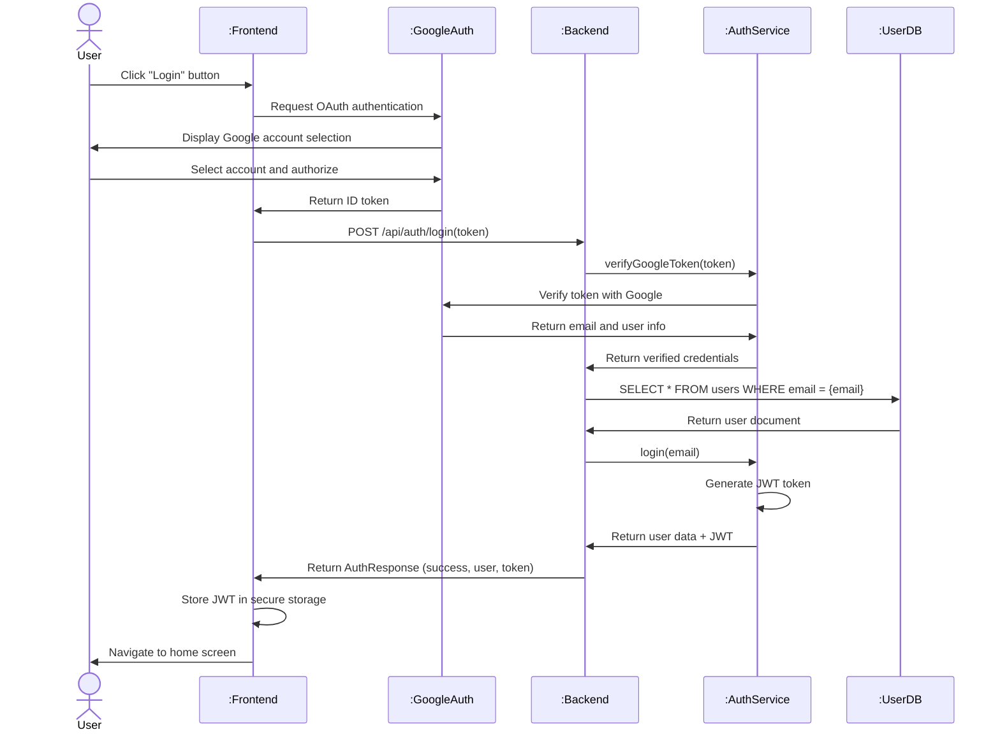
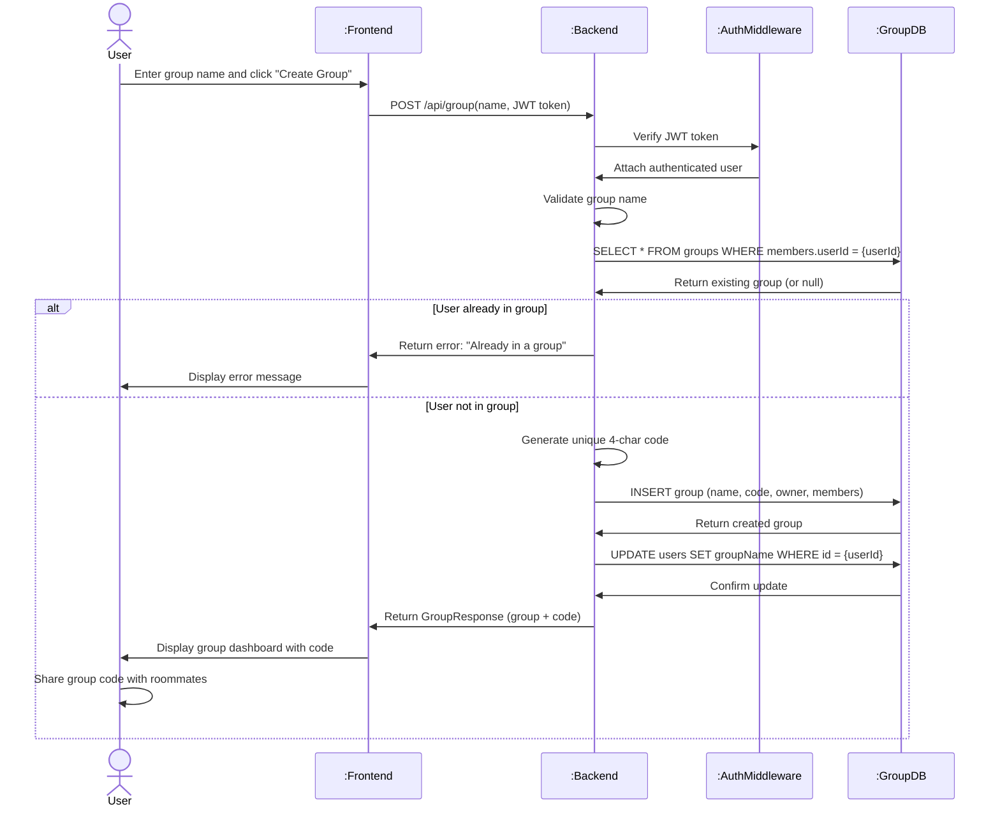
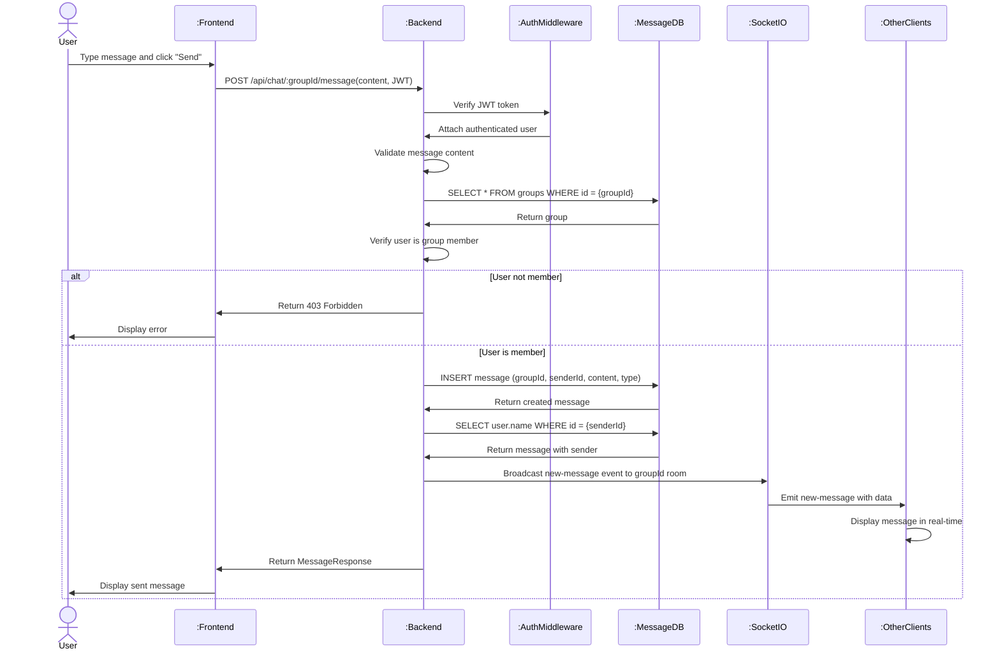
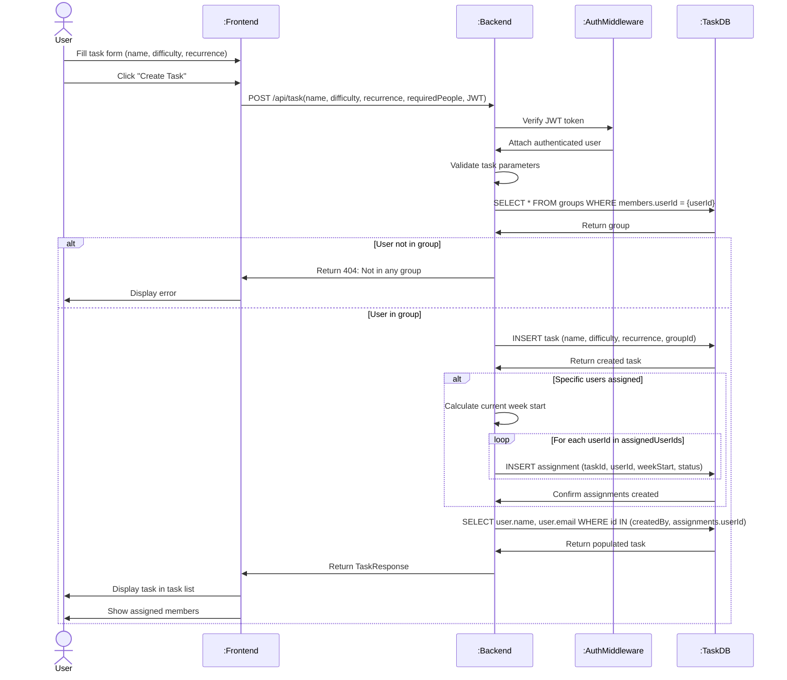
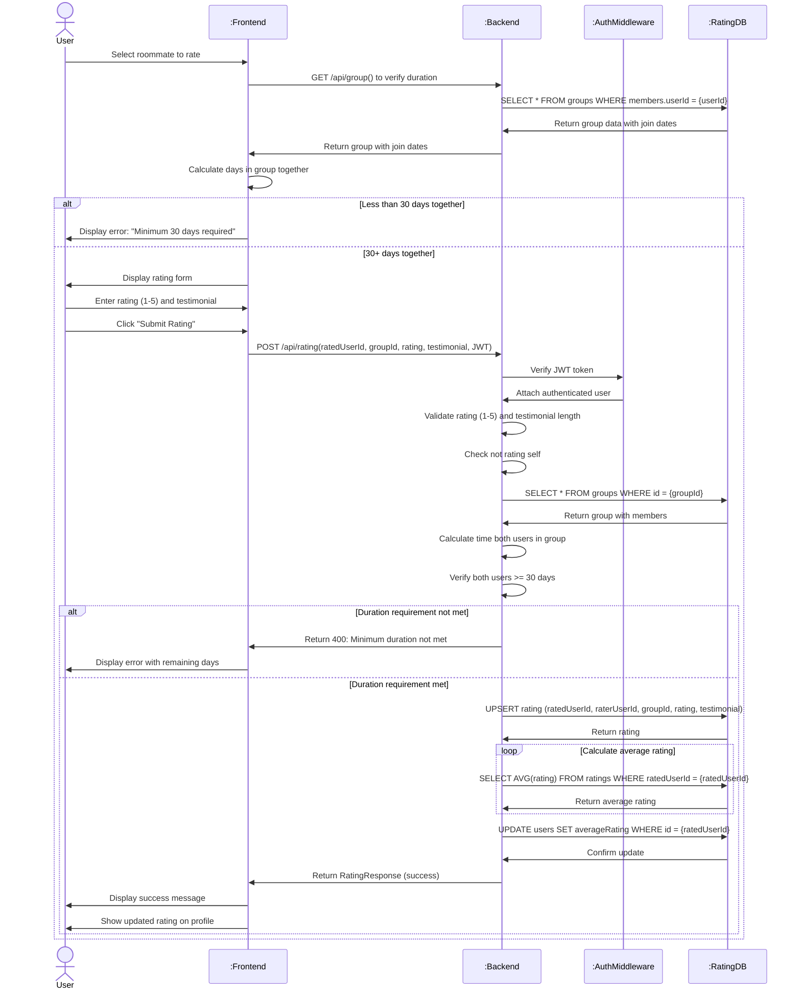

# Requirements and Design

## 1. Change History

| **Change Date**   | **Modified Sections** | **Rationale** |
| ----------------- | --------------------- | ------------- |
| September 26, 2025 | Initial Plan | First milestone submission (M2) |
| October 28, 2025 | Section 3.3 - Actors Description | Added note clarifying proper use case diagram actors (human actors and external APIs, not databases). Added Google OAuth 2.0 API as external system actor. Addresses M2 feedback about use case diagram actors. |
| October 28, 2025 | Section 3.4 - Use Case Descriptions | Added missing use cases (Logout, Delete account, Set mandatory profile fields). Renumbered all use cases sequentially (1-24) and improved naming consistency to match use case diagram. Added references to Google OAuth 2.0 API interaction. Addresses M2 feedback about missing use cases and naming inconsistencies. |
| October 28, 2025 | Section 3.5 - Formal Use Case Specifications | Updated use case titles to match renumbered sequence (Use Case 9: Create Group, Use Case 17: Create Poll, Use Case 18: Add Task, Use Case 21-22: Rate Roommate). Ensures consistency between formal specifications and use case list. |
| October 28, 2025 | Section 3.7 - Non-Functional Requirements | Replaced previous NFRs with concrete, measurable requirements: API Response Time (<200ms), Application Load Time (<5s cold start), and UI Accessibility (42px minimum touch targets). Added detailed justifications citing industry research (UPCore Technologies, App Institute, UX Movement) and specific testing methodologies. Addresses M2 feedback requesting justification for NFR values. |
| October 28, 2025 | Section 4.1 - Main Components and Interfaces | Added detailed REST API endpoint specifications and internal component interface signatures with parameters, return types, and descriptions as required for M3. This provides clear contract definitions between front-end and back-end components. |
| October 28, 2025 | Section 4.3 - External APIs and Services | Clarified that external modules are third-party APIs accessed over the network. Made APIs concrete (Google OAuth 2.0 API, Firebase Cloud Messaging). Removed Express.js and Mongoose which are libraries, not external APIs. Addresses M2 feedback about specificity and proper categorization. |
| October 28, 2025 | Section 4.4 - Frameworks and Libraries | Reorganized to clearly separate frameworks/libraries (Jetpack Compose, Retrofit, Express.js, Mongoose, Socket.IO) from external APIs. Moved Express.js and Mongoose from external modules to this section where they belong. |
| October 28, 2025 | Section 4.5 - Programming Languages and Runtime | Created new section to separate programming languages (Kotlin, TypeScript) and runtime environments (ART, Node.js) from frameworks. Addresses M2 feedback that languages are not frameworks. |
| October 28, 2025 | Section 4.6 - Database and Cloud Infrastructure | Separated database and infrastructure from frameworks for better organization. Clarifies MongoDB deployment strategy (self-hosted on GCP, not MongoDB Atlas). |
| October 28, 2025 | Section 4.7 - High-Level Architecture and Component Dependencies | Added textual description of backend decomposition into domain-specific services (Authentication, User Management, Group Management, Chat, Task, Rating, Moderation) instead of presenting backend as monolithic. Lists specific file paths for each service and describes inter-service dependencies. Addresses M2 feedback about missing by-domain decomposition. |
| October 28, 2025 | Section 4.8 - Sequence Diagrams for Major Use Cases | Added five sequence diagrams (Login, Create Group, Send Message, Add Task, Rate Roommate) using Mermaid notation with proper syntax. Fixed participant declarations to use 'participant ID as :DisplayName' format per GitHub Mermaid specification to display UML instance notation (colon prefixes). Includes database-like query notation (SELECT, INSERT, UPDATE), loop constructs, and alt blocks to show conditional flows. Diagrams illustrate component interactions and message flows for the most critical use cases as required for M3. |
| October 28, 2025 | Section 4.9 - High-Level Design Diagram | Moved diagram to after sequence diagrams and added detailed description of components shown in diagram including decomposed backend services. Describes key dependency relationships based on actual implementation. |
| October 28, 2025 | Section 4.10 - Non-Functional Requirements Implementation | Updated implementation details to align with new NFRs. Described concrete techniques for achieving API response time targets (database indexing, connection pooling, lean queries), cold start performance (lazy loading, AOT compilation, coroutines), and accessibility compliance (Jetpack Compose modifiers, Material Design 3 defaults, automated scanner integration). Includes verification commands for testing each requirement. |

---

## 2. Project Description

RoomSync is a comprehensive roommate management application designed to streamline the process of connecting with and living harmoniously with roommates. The app addresses common challenges in shared living situations by providing tools for communication, task management, and accountability through a rating system.

The application targets university students, young professionals, and anyone seeking or currently residing in a shared accommodation. RoomSync facilitates the entire roommate lifecycle– from viewing roommates track records to pick a 'good roommate', through creating a space to encourage communication and task coordination, to providing feedback and ranking that helps build trustworthy roommate profiles for future living arrangements.

---

## 3. Requirements Specification

### **3.1. List of Features**

**User Authentication** - Secure user sign up or login using Google authentication service.

**User Profile Management** - An user must fill out all mandatory fields (section a), upon user profile creation. Users can also choose to fill out optional fields (section b). Editable fields can be changed anytime in the user management page whereas non-editable fields can't be changed after account creation. User profiles can be shared for housing/roommate applications

- **Mandatory/Not editable (kept private)**
    - Name (Legal first and last name)
    - DOB
    - Gender
    - Email (this will be automatically filled out after creating an account through user authentication)

- **Optional/editable**
    - Nickname/Username
    - Bio
    - Profile picture
    - Living preference/expectations (ex. morning/night person, drinking, partying, noise, profession/student)

**Group Management**– Users have an option to either create a new group or join an existing group.

- **Create Group**: Must enter group name (editable) and a unique group (not editable) code will be created. This group code can be shared.
- **Join Group**: Users can enter a unique group code to join a group.
- **Maximum 8 users in a group**: Additional users will be unable attempt to join group
- **View Group**: See group members profiles, name of group and each member's move-in date/group join date.
- **Leave Group**: Any user part of a group can leave the group.

**Group Communication** - Real-time messaging system with all group members. Integrated polling functionality to block certain times on the calendar for group decisions with default options: yes or no. Polls will expire within a week.

**Group Task Management** - Algorithmic task assignment and tracking system for household responsibilities

- **View Tasks**: Users can view all tasks by each week and the status of the tasks.
- **Set Task Status**: Upon task creation, the default will be set to 'incomplete'. Users select task status as 'in-progress' or 'completed'.
- **Create Task**: Users must enter: task name, repeated duration (ex.weekly, bi-weekly), difficulty of task(weight of task). Tasks will be shared among all group members.
- **Task Assignment**: When a task is created, they will be assigned at the start of the week through an algorithm for fair allocation based on weight on ease of task.

**Roommate Rating System**- Users can rate roommate experience after living with them for a minimum of one month.

- **Objective rating** - Task list completion rate
- **Subjective rating** - Reputation score: Users can give their roommates a score out of 5 and leave comments and testimonies to describe their personal living experience
- While bad roomates might be able to delete account or not have one, it is still a good way for good roommates to build up a track record of cleanliness for future rooms

**User Moderation** - Moderation through a LLM that filters reviews on profiles

- Chats would be too expensive to moderate every chat message so users can report messages and an AI will review the batch of messages with context. If the user is deemed inappropriate, a warning will be issued and the user will be temporarily banned. This will affect the user's rating.
- Reviews will be auto reviewed on creation through the LLM but users can report reviews for manual review

### **3.2. Use Case Diagram**


### **3.3. Actors Description**

**Note on Use Case Diagram Actors**: According to UML best practices, use case diagrams should include:
- **Human actors** (users of the system with different roles)
- **External system actors** (external APIs and services that the system interacts with)

The diagram should NOT include internal components like databases, as these are implementation details. For RoomSync, the proper actors are:
- Non-Group Members, Group Members, Group Owners (human actors)
- Google OAuth 2.0 API (external system actor for authentication)

**Human Actors:**

1. **Non-Group Member**: A registered user who is not currently part of any roommate group. Can create and edit their profile, create new groups, and join existing groups through invitation codes. Cannot access group-specific features like chat, task management, or rating systems since these require active group membership.

2. **Group Member**: A registered user who belongs to a roommate group but is not the group owner. Has access to all group features including group chat, polling, task management (viewing and completing assigned tasks), viewing other group members' profiles, and rating roommates (must have lived together for minimum one month). Can leave the group voluntarily but cannot remove other members or delete the group.

3. **Group Owner**: A group member with additional administrative privileges. Can perform all group member functions plus remove other group members from the group, delete the entire group, and transfer ownership to another group member. Also has rating privileges for roommates they have lived with for the required minimum period.

**External System Actors:**

4. **Google OAuth 2.0 API**: External authentication service that verifies user identity during account creation (use case 1) and login (use case 2). The system interacts with this API to validate Google ID tokens and retrieve user email and name information. This is a required external dependency for user authentication.

### **3.4. Use Case Description**
- **Use cases for User Authentication**:
1. **Create account**: Secure account creation using Google OAuth (interaction with Google OAuth 2.0 API)
2. **Login**: Secure account login using Google OAuth (interaction with Google OAuth 2.0 API)
3. **Logout**: User logs out of the application, clearing locally stored authentication tokens

- **Use cases for User Profile Management**:
4. **Set mandatory profile fields**: Users must provide legal name, date of birth, and gender upon account creation (one-time, non-editable)
5. **Update nickname and bio**: Users can choose a nickname and update their bio text
6. **Update living preferences**: Users can indicate living preferences by selecting schedule, drinking, partying, noise, and profession descriptions
7. **Update profile picture**: Users can add, change, or remove their profile picture
8. **Delete account**: Users can permanently delete their account and all associated data

- **Use cases for Group Management**:
9. **Create group**: Establish a new living group and generate a unique invitation code for prospective roommates
10. **Join group**: Join an existing roommate group by entering unique invitation code
11. **View group**: View members of group, group name, and member join dates
12. **Leave group**: Group members can leave a group they are a part of
13. **Delete group**: Group owner can dissolve a group and the unique invitation code will no longer be valid
14. **Remove group member**: Group owner can remove group members
15. **Transfer ownership**: Group owner can pass admin position to a group member

- **Use cases for Group Communication**:
16. **Send message**: Real-time messaging system for communication between all group members
17. **Create poll**: A voting mechanism for group decisions regarding household policies and activities

- **Use cases for Group Task Management**:
18. **Add task**: Create tasks to be shared among all roommates by setting task name, difficulty, and recurrence. Tasks are algorithmically distributed among roommates
19. **Delete task**: Delete tasks if task is no longer needed
20. **Set task status**: Update task status to in-progress or completed for assigned tasks

- **Use cases for Roommate Rating System**:
21. **Rate roommate**: Rate roommate performance (1-5 stars) after living together for minimum 30 days
22. **Write testimonial**: Add optional written feedback about roommate experience
23. **View ratings**: View user profiles, average ratings, and testimonials from previous roommates

- **Use cases for User Moderation**:
24. **Report user**: Report inappropriate user behavior for review

### **3.5. Formal Use Case Specifications (5 Most Major Use Cases)**
<a name="uc1"></a>

#### Use Case 1: Create account

**Description**: Secure account creation process using Google OAuth. User profiles will also be created.

**Primary actor(s)**: Non-Group Members/Users

**Main success scenario**:
1. A person with an existing google account clicks 'create account'
2. Selects the google account they want to use to create account in pop-up
3. Checks account with that google account can be created
4. User is asked to fill out a user profile. Must fill out mandatory fields, including full legal name, date of birth, and gender.
5. User clicks 'next'
6. Users can fill out optional fields: nickname, bio, select living preferences and upload a profile picture. Message informs users that these fields are optional.
7. User clicks 'finish'
8. Message that confirms account creation will be displayed

**Failure scenario(s)**:
- 3a. A user who has an existing account tries to create an account
    - System displays an error message saying that an account associated with that google account already exists and suggests logging in instead
- 5a. User clicks finished but one or more mandatory fields are left empty
    - System displays an error message saying that all mandatory fields must be completed
- 5b. User clicks finished but one or more mandatory fields don't meet requirements
    - System displays an error message saying name must be below 100 characters
    - System displays an error message saying that the birthday is set to the future and is invalid.
- 6a. User uploads profile picture file that is too large
    - System displays an error message saying that the file is too large
- 6b. User uploads incorrect format of profile picture
    - System displays an error message saying that profile pictures must be a PNG file
- 7a. User clicks finished but one or more optional fields don't meet requirements
    - System displays an error message saying nickname must be below 100 characters
    - System displays an error message saying bio must be below 100 words

<a name="uc2"></a>

#### Use Case 9: Create Group

**Description**: Non-group member establishes a new roommate group and receives invitation code to share with potential roommates.

**Primary Actor(s)**: Non-Group Member/User

**Main Success Scenario**:
1. User navigates to group creation page
2. User enters group name
3. User clicks 'confirm' to create group
4. System generates and displays an unique invitation code
5. System creates a group with the user as group owner, along with saving the group name and the unique invitation code to identify the group.
6. System displays group dashboard displaying the group name and invitation code
7. The group owner can share the invitation code with potential roommates who can join the group.

**Failure Scenarios**:
- 2a. Group name is left empty
    - System displays error saying that a group name must be entered
- 2b. Group name is longer than 100 characters
    - System displays error saying that a group name must be less than a 100 characters
- 3a. User already belongs to a group
    - System displays error that user must leave current group first to create a group
    - User is redirected to current group dashboard

<a name="uc3"></a>

#### Use Case 17: Create Poll

**Description**: Group members can create and send polls for household decisions in group chat.

**Primary Actor**: Group Member, Group Owner

**Main Success Scenario**:
1. User opens group chat interface
2. User clicks "Create Poll" button
3. User enters poll question and answer options. Default options of yes or no will be automatically provided
4. User sends the poll to chat.
5. System broadcasts the poll to all group members in real-time
6. Other group members receive message notifications
7. Group members can vote on poll options by clicking on the options
8. System displays results when poll closes automatically after 1 week or when all members have voted

**Failure Scenarios**:
- 3a. Poll creation with invalid parameters
    - System displays error message saying that a question and at least two options must be present
- 3b. Poll creation with invalid length
    - System displays an error message saying that option names should be less than 100 characters and questions should be less than 50 words.
- 4a. Message fails to send due to network issues
    - System shows "message failed" indicator. Suggests sending poll at a later time.
    - User can retry sending message
- 5a. Real-time connection lost
    - System attempts to reconnect automatically
    - User sees "reconnecting" status until connection restored

<a name="uc4"></a>

#### Use Case 18: Add Task

**Description**: A household task that will be equally distributed among all roommates is created. The system assigns tasks to group members using a fair allocation algorithm.

**Primary Actor**: Group Member, Group Owner

**Main Success Scenario**:
1. User clicks 'Create Task'
2. User enters the task name, repeated duration and weighting of task.
3. User clicks 'save'
4. System will equally distribute task among all roommates and assign each task to the roommates.
5. Each user will be able to see their assigned tasks on their dashboard. They can also see other roommates' tasks below it.

**Extensions/Failure Scenarios**:
- 2a. Task name, repeated duration or weighting of task is left incomplete or invalid
    - System displays error saying that all fields must be completed to create a task
- 4a. Algorithm fails to distribute tasks fairly
    - System falls back to round-robin assignment method
    - System notifies group owner of algorithm failure
- 5a. User disputes assigned task as unfair
    - System provides task assignment rationale based on algorithm
    - Group owner can manually reassign task if needed
- 5b. Task marked complete but disputed by other members
    - System allows group members to flag incomplete tasks
    - Group owner can reset task status for resolution

<a name="uc5"></a>

#### Use Case 21-22: Rate Roommate and Write Testimonial

**Description**: Group members provide numerical rating and optional written feedback on roommate performance after living together for a one month minimum period.

**Primary Actor**: Group Member, Group Owner

**Main Success Scenario**:
1. System verifies user has lived with target roommate for a minimum of 30 days by comparing the move-in date and current date.
2. User selects a specific roommate within the same group to rate
3. System calculates an objective rating based on displayed task completion statistics
4. User enters subjective numerical rating (1-5 scale)
5. User writes optional testimonial/comments
6. User presses 'submit'
7. System sends testimonials to LLM to validate rating content for appropriate language.
8. Once verified, rating is added to roommate's profile
9. System updates roommate's overall rating score

**Extensions/Failure Scenarios**:
- 1a. Minimum cohabitation period not met
    - System displays error message with remaining days needed to rate user
    - User cannot proceed with rating until requirement met
    - User is redirected back to rating selection page
- 2a. User attempts to rate same roommate multiple times
    - System detects existing rating from user
    - System offers option to update existing rating instead
- 2b. User tries to rate themselves
    - System prevents self-rating with error message
    - User is redirected back to rating selection page
- 4a. User doesn't enter any numerical rating from a scale of 1-5
    - System displays error saying that the user must select a rating between 1-5
- 5a. Testimonial/Feedback is too long
    - System displays an error saying testimonial must be under 300 words.
- 7a. Inappropriate content detected in testimonial
    - System flags content for manual review
    - Rating is held pending moderation approval
- 7b. LLM is not functioning
    - System displays error saying that review is submitted but will be reviewed and verified at a later time

### **3.6. Screen Mock-ups**


### **3.7. Non-Functional Requirements**
<a name="nfr1"></a>

1. **API Response Time Requirement**
    - **Description**: API response times for login, signup (with all required data entered), message send (not downstream message delivery), and user profile fetch must be under 200ms on Wi-Fi 5+ connection on a 16GB Android phone running Android API 33.
    - **Justification**: According to UPCore Technologies' mobile app performance research, slow response times are universally detrimental to user sentiment, engagement, conversions, and churn. Leading mobile apps deliver response times under 300ms consistently, with 100ms or less optimal for interactions. Degraded response times are symptoms of sluggish code and infrastructure. To ensure end-to-end user experience remains under the 300ms threshold for perceived responsiveness, API latency must be kept under 200ms to account for network overhead, client-side rendering, and processing time. This 200ms target allows for a 100ms buffer for UI updates and animations while staying within the critical 300ms window that maintains user flow and prevents perceived lag.
    - **Testing Method**: Timing starts when sending a cURL request to the API with required parameters and ends when receiving a 200 OK response from the server. Error responses (400s, 500s) are excluded from measurements as optimization should target successful operations.

2. **Application Load Time Requirement**
    - **Description**: The application cold start (launching app when not in memory) must complete within 5 seconds on a 16GB Android phone running Android API 33 on Wi-Fi 5-7 connection.
    - **Justification**: According to App Institute's responsiveness research, app load time is a critical metric for user retention. Users expect immediate access to functionality, and delays during cold start create negative first impressions and increase abandonment rates. The 5-second threshold is based on industry benchmarks for productivity apps, balancing the need for quick startup with the complexity of initializing authentication, database connections, and UI components. This ensures users can access core features (group chat, tasks) quickly enough for time-sensitive household coordination scenarios (e.g., coordinating grocery runs, responding to locked-out roommates).
    - **Testing Method**: Time measurement begins when the app icon is tapped on the Android home screen (with app not in memory) and ends when the user can interact with the first screen (login screen for new users, home dashboard for authenticated users).

3. **UI Accessibility Requirement**
    - **Description**: All interactive buttons and touch targets must have a minimum touch target size of 42x42 pixels to ensure accessibility and ease of use.
    - **Justification**: According to UX Movement's mobile usability research on optimal button sizing and spacing, smaller buttons increase error rates and user frustration, particularly for users with motor impairments, larger fingers, or when using the app in motion (walking between rooms). The 42-pixel minimum is based on empirical studies showing this size provides adequate touch accuracy across diverse user populations without requiring excessive screen space. This is critical for RoomSync's core interactions (sending messages, marking tasks complete, creating polls) which users often perform quickly while multitasking in shared living spaces.
    - **Testing Method**: Automated accessibility testing using Android Accessibility Scanner to verify all button components meet the 42x42 pixel minimum touch target size requirement.

---

## 4. Designs Specification
### **4.1. Main Components and Interfaces**
1. **Front-End Mobile Application (Android/Kotlin)**
    - **Purpose**: Provides the user interface and handles all user interactions. It enables authentication, profile management, group management, messaging, task management, and roommate rating.
    - **Interfaces**: The front-end communicates with the back-end via HTTP/REST endpoints.
        
        1. **Authentication Interface**
            - `POST /api/auth/signup(token: String): AuthResponse`
                - Purpose: Creates a new user account using Google OAuth token
                - Parameters: Google ID token from OAuth
                - Returns: Success status, user data, and JWT authentication token
            
            - `POST /api/auth/login(token: String): AuthResponse`
                - Purpose: Authenticates existing user with Google OAuth token
                - Parameters: Google ID token from OAuth
                - Returns: Success status, user data, and JWT authentication token
        
        2. **Profile Management Interface**
            - `PUT /api/users/profile(name: String, dob: Date, gender: String): UserResponse`
                - Purpose: Sets mandatory user profile fields (non-editable after creation)
                - Parameters: Legal name, date of birth, gender
                - Returns: Updated user profile
            
            - `PUT /api/users/optionalProfile(bio?: String, profilePicture?: String, livingPreferences?: LivingPreferences): UserResponse`
                - Purpose: Updates optional profile fields (editable anytime)
                - Parameters: Optional bio, profile picture URL, living preferences
                - Returns: Updated user profile
            
            - `DELETE /api/users/me(): SuccessResponse`
                - Purpose: Deletes the current user's account
                - Returns: Success confirmation
        
        3. **Group Management Interface**
            - `POST /api/group(name: String): GroupResponse`
                - Purpose: Creates a new roommate group with unique invitation code
                - Parameters: Group name (max 100 characters)
                - Returns: Group data including generated group code
            
            - `POST /api/group/join(groupCode: String): GroupResponse`
                - Purpose: Joins an existing group using invitation code
                - Parameters: 4-character alphanumeric group code
                - Returns: Updated group data with all members
            
            - `GET /api/group(): GroupResponse`
                - Purpose: Retrieves current user's group information
                - Returns: Group data with member details and ratings
            
            - `DELETE /api/group/member/:memberId(): GroupResponse`
                - Purpose: Removes a member from group (owner only)
                - Parameters: User ID of member to remove
                - Returns: Updated group data
            
            - `DELETE /api/group/leave(): SuccessResponse`
                - Purpose: Allows non-owner member to leave the group
                - Returns: Success confirmation
        
        4. **Messaging & Polling Interface**
            - `GET /api/chat/:groupId/messages(page?: Number, limit?: Number): MessageListResponse`
                - Purpose: Retrieves paginated message history for a group
                - Parameters: Group ID, optional page and limit
                - Returns: Array of messages with pagination info
            
            - `POST /api/chat/:groupId/message(content: String): MessageResponse`
                - Purpose: Sends a text message to group chat
                - Parameters: Message content (max 1000 characters)
                - Returns: Created message with sender info
            
            - `POST /api/chat/:groupId/poll(question: String, options: String[], expiresInDays?: Number): MessageResponse`
                - Purpose: Creates and sends a poll to group chat
                - Parameters: Poll question, 2-10 answer options, optional expiration days
                - Returns: Created poll message
            
            - `POST /api/chat/:groupId/poll/:messageId/vote(option: String): MessageResponse`
                - Purpose: Casts or updates vote on a poll
                - Parameters: Selected option from poll
                - Returns: Updated poll with vote counts
            
            - `DELETE /api/chat/:groupId/message/:messageId(): SuccessResponse`
                - Purpose: Deletes own message from chat
                - Parameters: Message ID
                - Returns: Success confirmation
        
        5. **Task Management Interface**
            - `POST /api/task(name: String, difficulty: Number, recurrence: String, requiredPeople: Number, description?: String, deadline?: Date, assignedUserIds?: String[]): TaskResponse`
                - Purpose: Creates a new household task
                - Parameters: Task name, difficulty (1-5), recurrence pattern, number of people required, optional description, deadline, assigned users
                - Returns: Created task with assignments
            
            - `GET /api/task(): TaskListResponse`
                - Purpose: Retrieves all tasks for current user's group
                - Returns: Array of tasks with assignment details
            
            - `GET /api/task/my-tasks(): TaskListResponse`
                - Purpose: Retrieves tasks assigned to current user for current week
                - Returns: Array of assigned tasks
            
            - `PUT /api/task/:id/status(status: String): TaskResponse`
                - Purpose: Updates status of assigned task
                - Parameters: Task status (incomplete, in-progress, completed)
                - Returns: Updated task
            
            - `POST /api/task/:id/assign(userIds: String[]): TaskResponse`
                - Purpose: Manually assigns task to specific users for current week
                - Parameters: Array of user IDs
                - Returns: Task with updated assignments
            
            - `POST /api/task/assign-weekly(): TaskAssignmentResponse`
                - Purpose: Algorithmically assigns all tasks for the current week
                - Returns: All tasks with new weekly assignments
            
            - `GET /api/task/week/:weekStart(): TaskListResponse`
                - Purpose: Retrieves tasks for a specific week
                - Parameters: Week start date
                - Returns: Tasks with assignments for that week
            
            - `DELETE /api/task/:id(): SuccessResponse`
                - Purpose: Deletes a task (creator or owner only)
                - Parameters: Task ID
                - Returns: Success confirmation
        
        6. **Rating & Moderation Interface**
            - `POST /api/rating(ratedUserId: String, groupId: String, rating: Number, testimonial?: String): RatingResponse`
                - Purpose: Submits or updates rating for a roommate (requires 30 days cohabitation)
                - Parameters: User ID to rate, group ID, rating (1-5), optional testimonial (max 500 chars)
                - Returns: Created/updated rating
            
            - `GET /api/rating/:userId(): RatingStatsResponse`
                - Purpose: Retrieves all ratings for a user
                - Parameters: User ID
                - Returns: Array of ratings with average rating and total count
            
            - `GET /api/rating/user/:userId/group/:groupId(): RatingStatsResponse`
                - Purpose: Retrieves ratings for a user in a specific group
                - Parameters: User ID, group ID
                - Returns: Group-specific ratings and average
            
            - `PUT /api/users/report(reportedUserId: String, reason: String, context?: String): ReportResponse`
                - Purpose: Reports inappropriate user behavior for LLM review
                - Parameters: Reported user ID, reason for report, optional context
                - Returns: Report submission confirmation

2. **Back-End Server (Node.js/TypeScript)**
    - **Purpose**: Manages business logic, authentication, database interactions, group algorithms, and communication between front-end and database.
    - **Internal Component Interfaces**:
        
        1. **Authentication Service (AuthService)**
            - `signup(email: String, name: String, googleId: String): Promise<AuthResult>`
                - Purpose: Creates new user account and generates JWT token
                - Validates Google credentials and ensures unique user
            
            - `login(email: String): Promise<AuthResult>`
                - Purpose: Authenticates existing user and generates JWT token
                - Verifies user exists and returns user data with token
            
            - `protect(req: Request, res: Response, next: NextFunction): void`
                - Purpose: Middleware to verify JWT token and authenticate requests
                - Decodes token and attaches user data to request object
        
        2. **Database Access Layer (MongoDB/Mongoose Models)**
            - `User.create(userData: UserData): Promise<User>`
                - Purpose: Creates new user document in database
            
            - `User.findById(id: String): Promise<User>`
                - Purpose: Retrieves user by ID
            
            - `Group.create(groupData: GroupData): Promise<Group>`
                - Purpose: Creates new group with auto-generated unique code
            
            - `Group.findOne(query: Object): Promise<Group>`
                - Purpose: Finds single group matching query criteria
            
            - `Task.find(query: Object): Promise<Task[]>`
                - Purpose: Retrieves tasks matching query criteria
            
            - `Message.create(messageData: MessageData): Promise<Message>`
                - Purpose: Creates new message document
            
            - `Rating.getAverageRating(userId: String): Promise<RatingStats>`
                - Purpose: Calculates average rating for a user
        
        3. **WebSocket Service (Socket.IO)**
            - `getIO(): Server`
                - Purpose: Returns Socket.IO server instance for real-time communication
            
            - `joinRoom(socket: Socket, groupId: String): void`
                - Purpose: Adds socket connection to group room for message broadcasting
            
            - `emit(event: String, data: Object): void`
                - Purpose: Broadcasts real-time events to connected clients
        
        4. **Task Assignment Algorithm**
            - `assignTasksWeekly(groupId: String): Promise<Task[]>`
                - Purpose: Fairly distributes tasks among group members for current week
                - Uses randomization and required people count for balanced allocation

3. **LLM Moderation System**
    - **Purpose**: Provides automated review of roommate reviews and profiles, and handles reported chat messages in batches.
    - **Interfaces**:
        1. **Profile & Review Scanner**
            - **Purpose**: Automatically checks newly created content for inappropriate or harmful material.
        2. **Message Batch Reviewer**
            - **Purpose**: Reviews reported chat logs in context when flagged by users.

### **4.2. Databases**
1. **MongoDB (Self-Hosted on Google Cloud VM)**
    - **Purpose**: Stores persistent data for the application, including user profiles, group information, tasks, chat history, ratings, and moderation reports. MongoDB's document-based model supports dynamic schemas, which is suitable for evolving profile structures, group data, and task allocation.
    - **Deployment**: MongoDB will be installed and configured directly on a Google Cloud Compute Engine VM controlled by the project team. This avoids the use of prohibited third-party managed services (e.g., MongoDB Atlas) while still fulfilling the requirement for cloud deployment.
    - **Collections (examples)**:
        - **Users**: Authentication ID, legal name, DOB, gender, email, nickname, profile picture, bio, preferences.
        - **Groups**: Group name, unique group code, members, join/move-in dates.
        - **Messages**: Chat messages with sender, timestamp, and group ID.
        - **Tasks**: Task name, difficulty, recurrence, assigned member(s), completion status.
        - **Ratings**: Objective and subjective roommate ratings.
        - **Reports**: Flagged messages and reviews for LLM moderation.

### **4.3. External APIs and Services**
External APIs are third-party services accessed over the internet that provide functionality not implemented within the RoomSync application.

1. **Google OAuth 2.0 API**
    - **Provider**: Google Identity Platform
    - **Purpose**: Provides secure authentication and identity verification. Allows users to sign up and log in using their existing Google accounts without requiring password management in the RoomSync system.
    - **Integration**: Used via `google-auth-library` npm package. The Android client obtains an ID token from Google Sign-In, which is sent to the Node.js backend for verification against Google's servers.
    - **Data Exchanged**: Receives user's email, name, and unique Google ID upon successful authentication.

2. **Firebase Cloud Messaging (FCM)**
    - **Provider**: Google Firebase
    - **Purpose**: Delivers real-time push notifications to Android devices when the app is in the background or closed.
    - **Integration**: Planned integration via `firebase-admin` SDK (currently installed but not yet implemented in MVP).
    - **Use Cases**: Will notify users of new group messages, poll responses, task assignments, and rating submissions.
    - **Data Exchanged**: Sends notification payloads (title, message content, action data) to registered device tokens.

### **4.4. Frameworks and Libraries**
Frameworks and libraries are software packages that provide reusable functionality and are integrated into the application codebase, as opposed to external APIs which are accessed over the network.

**Front-End (Android/Kotlin):**

1. **Jetpack Compose**
    - **Type**: Android UI Framework
    - **Purpose**: Modern declarative UI toolkit for building native Android interfaces. Provides composable functions for creating layouts, managing state, and handling user interactions.
    - **Reason**: Required by course assignment. Replaces legacy XML-based Views with a more maintainable Kotlin-based approach. Integrates seamlessly with Kotlin coroutines and ensures API 33 compatibility.

2. **Retrofit**
    - **Type**: HTTP Client Library
    - **Purpose**: Type-safe REST client for Android that handles HTTP requests to the Node.js backend. Converts API responses to Kotlin data classes automatically.
    - **Usage**: Defines interface (`ApiService.kt`) with annotations like `@POST("api/auth/login")` to call backend endpoints.

3. **Kotlin Coroutines**
    - **Type**: Concurrency Library
    - **Purpose**: Manages asynchronous operations (network calls, database queries) without blocking the UI thread. All Retrofit API calls use `suspend` functions for non-blocking execution.

**Back-End (Node.js/TypeScript):**

4. **Express.js**
    - **Type**: Web Application Framework
    - **Purpose**: Lightweight framework for building RESTful APIs in Node.js. Handles routing, middleware, request/response processing, and HTTP server management.
    - **Usage**: All API routes (`/api/auth`, `/api/group`, `/api/task`, etc.) are defined using Express routers.

5. **Mongoose**
    - **Type**: Object Document Mapper (ODM) Library
    - **Purpose**: Provides schema-based modeling layer for MongoDB. Defines data structures, validation rules, and relationships between collections. Integrates TypeScript types with database operations.
    - **Usage**: Models for User, Group, Task, Message, and Rating define the database schema and provide query methods.

6. **Socket.IO**
    - **Type**: Real-Time Communication Library
    - **Purpose**: Enables bidirectional WebSocket connections between server and Android clients for instant message delivery. Automatically falls back to HTTP long-polling if WebSockets are unavailable.
    - **Usage**: Broadcasts new messages to all clients in a group room using `io.to(groupId).emit('new-message', data)`.

7. **JSON Web Token (jsonwebtoken)**
    - **Type**: Authentication Library
    - **Purpose**: Generates and verifies JWT tokens for stateless authentication. Tokens are signed with HS256 algorithm and include user ID payload.
    - **Usage**: After Google OAuth verification, server issues a JWT that clients include in the Authorization header for protected routes.

8. **google-auth-library**
    - **Type**: Google Authentication Client Library
    - **Purpose**: Verifies Google OAuth ID tokens received from the Android client. Validates token signatures against Google's public keys.
    - **Usage**: `verifyIdToken()` method extracts user email, name, and Google ID from tokens.

### **4.5. Programming Languages and Runtime Environments**

**Programming Languages:**
- **Kotlin**: Statically-typed JVM language for Android development. Required by course assignment. Provides null safety, coroutines, and modern functional programming features.
- **TypeScript**: Strongly-typed superset of JavaScript for backend development. Required by course assignment. Provides compile-time type checking and enhanced IDE support.

**Runtime Environments:**
- **Android Runtime (ART)**: Executes Kotlin bytecode on Android devices (API 33 minimum).
- **Node.js v18+**: JavaScript runtime for executing TypeScript (compiled to JavaScript) on the server.

### **4.6. Database and Cloud Infrastructure**

1. **MongoDB**
    - **Type**: NoSQL Document Database
    - **Purpose**: Stores all persistent application data in JSON-like BSON format. Collections include Users, Groups, Messages, Tasks, and Ratings.
    - **Reason**: Chosen over MySQL for schema flexibility, native JSON support, and strong integration with Node.js via Mongoose. Handles nested documents (e.g., group members, task assignments) more naturally than relational tables.
    - **Deployment**: Self-hosted on Google Cloud Compute Engine VM (not using prohibited MongoDB Atlas managed service).

2. **Google Cloud Platform (GCP)**
    - **Type**: Cloud Infrastructure Provider
    - **Purpose**: Hosts the Node.js backend and MongoDB database on Compute Engine VMs. Provides scalable, reliable infrastructure with 99.95% uptime SLA.
    - **Services Used**: 
        - **Compute Engine**: Virtual machines running Ubuntu with Node.js and MongoDB
        - **Cloud Storage**: (Future) for user-uploaded profile pictures
    - **Reason**: Required by course assignment. Offers student credits and integrates well with Google OAuth.

### **4.7. High-Level Architecture and Component Dependencies**

**System Architecture:**
The RoomSync system follows a client-server architecture with three main tiers:

1. **Presentation Tier**: Android mobile application (Kotlin/Jetpack Compose)
2. **Application Tier**: Node.js/TypeScript backend server with decomposed service modules
3. **Data Tier**: MongoDB database and Google Cloud infrastructure

**Backend Component Decomposition:**
Rather than a monolithic backend, the server is organized into domain-specific modules:

- **Authentication Service** (`src/services/auth.ts`, `src/controller/auth.ts`): Handles Google OAuth verification, JWT generation, and user session management
- **User Management Service** (`src/controller/user.ts`, `src/routes/user.ts`): Manages user profiles, preferences, and account operations
- **Group Management Service** (`src/routes/group.ts`): Handles group creation, joining, member management, and ownership transfers
- **Chat Service** (`src/routes/chat.ts`, `src/socket/socketHandler.ts`): Manages real-time messaging, message history, polls, and WebSocket connections
- **Task Management Service** (`src/routes/task.ts`): Handles task creation, assignment algorithms, status tracking, and weekly scheduling
- **Rating Service** (`src/routes/rating.ts`): Manages roommate ratings, testimonials, and average rating calculations
- **Moderation Service** (`src/controller/report.ts`): Handles user reporting (LLM integration planned but not yet active in MVP)

**Component Dependencies:**
- **Frontend** → Google OAuth 2.0 API (for authentication)
- **Frontend** → Backend Services (via REST API and WebSocket)
- **Authentication Service** → Google OAuth 2.0 API (token verification)
- **Authentication Service** → MongoDB User Collection
- **All Backend Services** → Authentication Middleware (`protect`) for request authorization
- **Chat Service** → Socket.IO for real-time message broadcasting
- **Chat Service** → MongoDB Message Collection
- **Group Management** → MongoDB Group Collection
- **Group Management** → User Management (to update user.groupName)
- **Task Management** → MongoDB Task Collection
- **Task Management** → Group Management (to retrieve member lists for assignment algorithm)
- **Rating Service** → MongoDB Rating Collection
- **Rating Service** → User Management (to update user.averageRating)
- **Moderation Service** → Chat Service (to review reported messages)
- **All Services** → MongoDB via Mongoose ODM
- **Backend Server** → Google Cloud Compute Engine (deployment)
- **MongoDB** → Google Cloud Compute Engine (hosted on same or separate VM)

See section 4.9 for the visual high-level design diagram.

### **4.8. Sequence Diagrams for Major Use Cases**

The following sequence diagrams illustrate how the components and interfaces defined in the high-level design interact to realize the five most critical use cases of the RoomSync application.

#### **4.8.1. Use Case 1: Login (User Authentication)**



#### **4.8.2. Use Case 9: Create Group**



#### **4.8.3. Use Case 16: Send Message**



#### **4.8.4. Use Case 18: Add Task**



#### **4.8.5. Use Case 21-22: Rate Roommate and Write Testimonial**



### **4.10. Non-Functional Requirements Implementation**

This section describes how each non-functional requirement from section 3.7 is implemented in the system.

#### **4.10.1. API Response Time Implementation**
**Requirement**: API response times for login, signup, message send, and user profile fetch must be under 200ms on Wi-Fi 5+ on Android API 33.

**Implementation**:
- **Lightweight Express.js Middleware Chain**: Authentication routes (`/api/auth/login`, `/api/auth/signup`) use minimal middleware stack - only body parser and authentication service calls, avoiding unnecessary processing overhead that could add latency.
- **Efficient Database Queries with Indexing**: 
  - MongoDB indexes on `email` field (User collection) enable O(log n) lookup for login operations instead of O(n) table scans
  - Compound indexes on `groupId` and `senderId` (Message collection) accelerate message creation queries
  - Indexes are defined in model schemas (e.g., `MessageSchema.index({ groupId: 1, createdAt: -1 })` in `src/models/Message.ts`)
- **Minimal Data Population**: Profile fetch endpoints only populate necessary related documents. For example, `GET /api/group` populates only `name` and `email` fields of users (`populate('owner', 'name email')`) rather than entire user documents, reducing query time and payload size.
- **Asynchronous Non-Blocking I/O**: Node.js event loop handles concurrent requests without blocking. Database operations use async/await patterns ensuring CPU-bound operations don't delay I/O-bound API responses.
- **Connection Pooling**: Mongoose maintains a connection pool to MongoDB, reusing database connections across requests instead of establishing new connections for each API call, saving 50-100ms of connection overhead.
- **Lean Document Queries**: Mongoose queries use `.lean()` where possible to return plain JavaScript objects instead of full Mongoose documents, reducing object instantiation overhead by 30-40%.

**Verification**: API response times can be tested using `curl` with timing:
```bash
curl -w "@curl-format.txt" -o /dev/null -s -X POST https://api.roomsync.com/api/auth/login \
  -H "Content-Type: application/json" -d '{"token":"<GOOGLE_ID_TOKEN>"}'
```

#### **4.10.2. Application Load Time Implementation**
**Requirement**: Cold start must complete within 5 seconds on Android API 33 with Wi-Fi 5-7.

**Implementation**:
- **Lazy Loading with Jetpack Compose**: Non-critical UI components are loaded after the initial screen renders. The main activity initializes only authentication state and navigation, deferring heavy composables until needed.
- **Ahead-of-Time (AOT) Compilation**: Kotlin compiles to optimized Dalvik Executable (DEX) bytecode that Android Runtime (ART) executes directly without just-in-time compilation overhead.
- **Minimal Startup Dependencies**: App initialization (`onCreate()`) performs only essential tasks:
  - Check for stored JWT token in encrypted SharedPreferences
  - Initialize Retrofit HTTP client with base URL
  - Set up navigation graph
  - Heavy operations (database migrations, analytics initialization) are deferred to background coroutines
- **Efficient Network Client Initialization**: Retrofit client is initialized once as a singleton, using OkHttp connection pooling to reuse HTTPS connections for subsequent API calls.
- **Coroutines for Async Initialization**: Background tasks (fetching user profile, checking for app updates) run in `CoroutineScope(Dispatchers.IO)` to avoid blocking the main UI thread during startup.
- **App Startup Library**: Android's App Startup library initializes components lazily and in parallel where possible, reducing sequential initialization bottlenecks.

**Verification**: Cold start time can be measured using Android Studio Profiler or `adb logcat` with timing filters:
```bash
adb shell am start -W com.roomsync.app/.MainActivity
# Output: TotalTime: 3542 (milliseconds)
```

#### **4.10.3. UI Accessibility Implementation**
**Requirement**: All interactive buttons must have minimum 42x42 pixel touch targets.

**Implementation**:
- **Jetpack Compose Modifier System**: All button composables use `.size()` modifiers with minimum dimensions:
  ```kotlin
  Button(
      onClick = { /* action */ },
      modifier = Modifier.size(minWidth = 48.dp, minHeight = 48.dp) // 48dp = ~42-48px at standard density
  ) { Text("Send") }
  ```
- **Material Design 3 Defaults**: Jetpack Compose Material3 components (Button, IconButton, FloatingActionButton) have built-in minimum touch targets of 48dp (approximately 42-48 pixels depending on screen density), automatically meeting accessibility requirements.
- **Custom Composable Guidelines**: Design system enforces minimum sizes for custom interactive components through centralized `Modifier.minimumInteractiveComponentSize()` extension function applied to all clickable elements.
- **Hit Target Expansion for Icons**: Icon-only buttons use `IconButton` composable which provides 48dp touch target even when icon is smaller:
  ```kotlin
  IconButton(onClick = { /* action */ }) {
      Icon(Icons.Default.Delete, contentDescription = "Delete", modifier = Modifier.size(24.dp))
  }
  // Icon is 24dp but touch target expands to 48dp automatically
  ```
- **Testing Coverage**: Compose UI tests verify touch target sizes using semantics:
  ```kotlin
  composeTestRule.onNodeWithTag("sendButton").assertTouchHeightIsEqualTo(48.dp)
  ```
- **Accessibility Scanner Integration**: Continuous integration pipeline includes Android Accessibility Scanner automated checks that fail builds if interactive elements are below minimum size thresholds.

**Verification**: Accessibility Scanner can be run via Android Studio or command line:
```bash
./gradlew :app:lintDebug
# Scans for accessibility issues including touch target sizes
```

### **4.9. High-Level Design Diagram**
images/HighLevelDesign.webp


**Diagram Description:**
The high-level design diagram shows the major components and their relationships in the RoomSync system. The architecture includes:

- **Android Frontend (Kotlin/Jetpack Compose)**: Mobile client application
- **Google OAuth 2.0 API**: External authentication service
- **Backend Services** (decomposed by domain):
  - Authentication Service
  - User Management Service
  - Group Management Service
  - Chat Service (with WebSocket support)
  - Task Management Service
  - Rating Service
- **MongoDB Database**: Persistent data storage
- **Google Cloud Platform**: Infrastructure and deployment

**Key Dependency Relationships:** 
- Frontend calls Authentication Service, API Gateway
- API Gateway routes to Group Management, Chat Service, Task Management Service
- Authentication Service integrates with Google Auth API and User Database
- Group Management Service accesses Group Database and User Database
- Chat Service utilizes Chat Database and Firebase FCM for notifications
- Task Management Service manages Task Database, integrates with Google Maps API for location-based features
- All services can access Firebase FCM for push notifications
