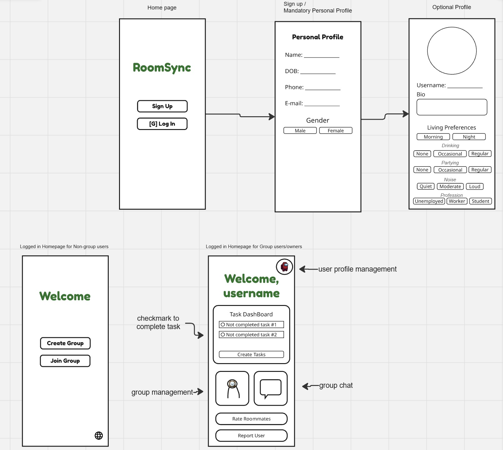
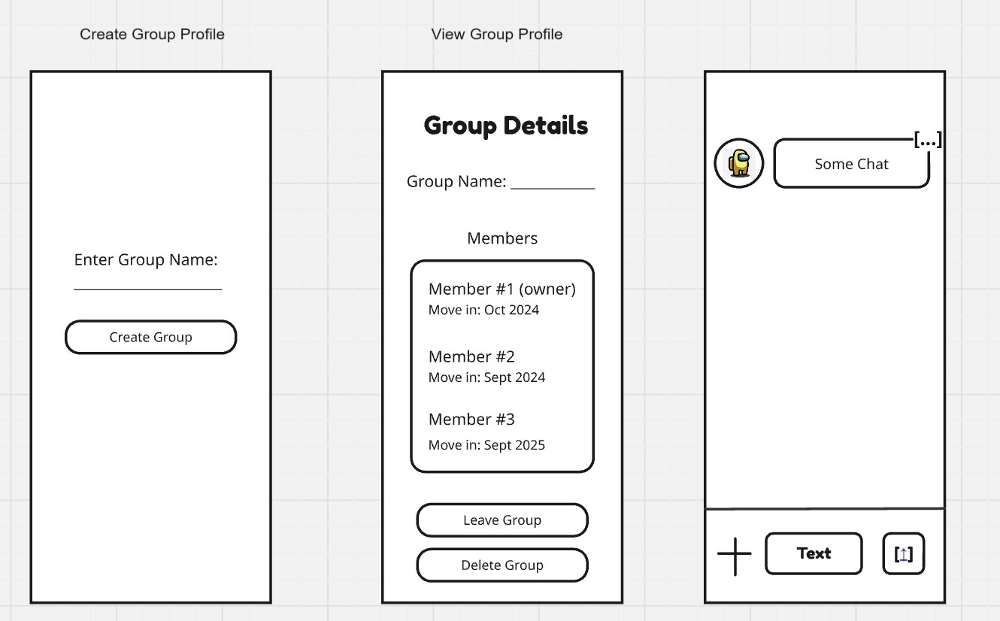
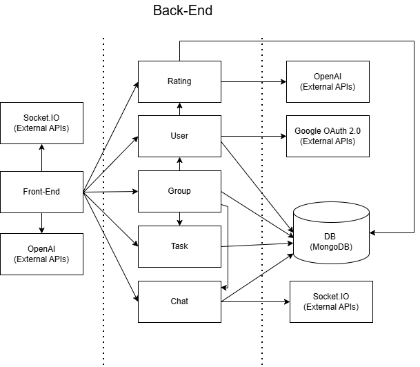
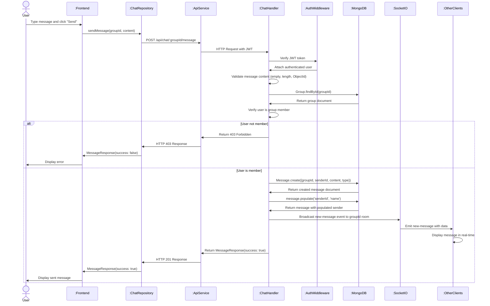
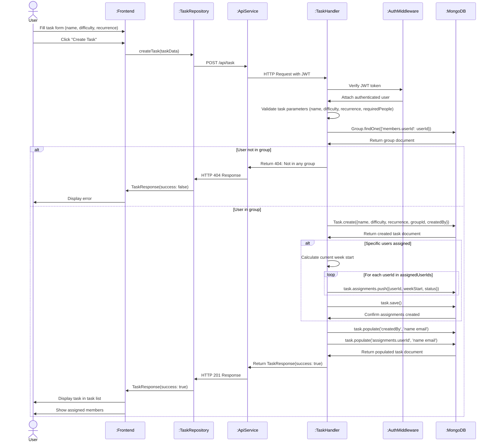
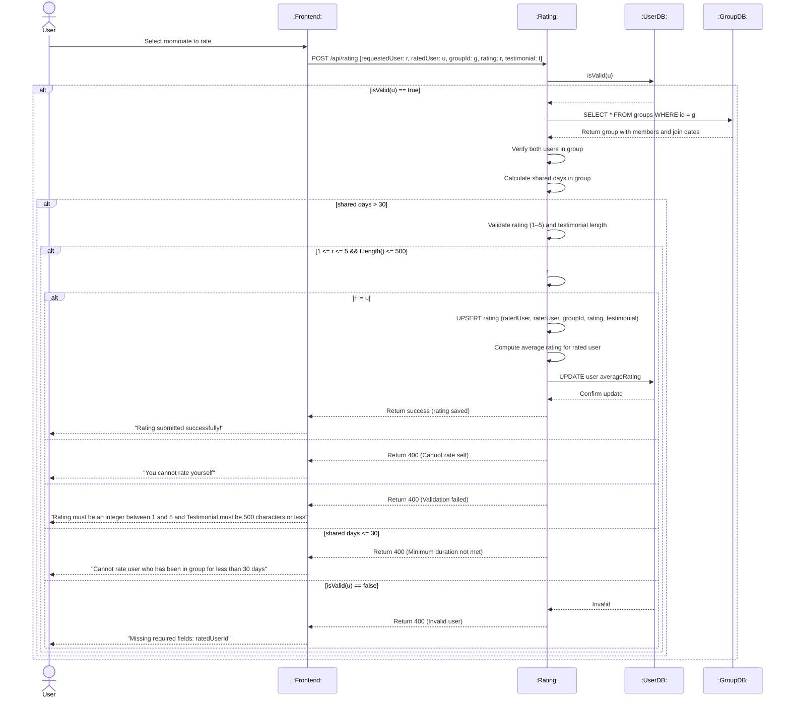

# Requirements and Design

## 1. Change History

| **Change Date** | **Modified Sections** | **Rationale** |
| --------------- | --------------------- | ------------- |
| September 26, 2025 | Initial Plan | First milestone submission (M2) |
| October 10, 2025 | Section 3.2, 3.7  | Fixed use case diagram according to feedback in M2 and non-function requirements section with concrete research to back up requirements |
| October 28, 2025 | Added section 4.4, 4.6, 4.7, Modified section 3.1, 4.1, 4.2, 4.3, 4.5 | Implemented M3 Requirements, fixed document according to app implementation and made further M2 feedback changes |
| November 9, 2025 | Section 3.4, 4.1 | Added missing endpoints (health check, transfer ownership, get profile, get tasks by date), corrected API endpoint paths and parameters, added transfer ownership use case |
| November 28, 2025 | Section 3.1, 3.2, 3.3, 3.4, 4.5 | Added more specific feature descriptions based on TA feedback. Edited use case names to match with use case diagram. Added additional external system actors based on changes to code. Updated dependencies diagram to match current code |
| November 28, 2025 | Section 3.5, 3.6, 3.7 | Fixed use case numbering issues and names based on above changes. Added mock-up screens we initally created. Edited non-functional requirements to match our existing tests |
| November 28, 2025 | Section 4.3, 4.4, 4.5 | Rename headers to specific names like OpenAI API not LLM Moderation. Got rid of Kotlin and Typescript as libraries and other unnecessary test as per TA feedback. Deleted unnecessary text for dependency diagram section and updated diagram to mirror current code. |
| November 28, 2025 | Section 4.1 | Updated due to changes in code and general structure of answer|

---

## 2. Project Description

RoomSync is a comprehensive roommate management application designed to streamline the process of connecting with and living harmoniously with roommates. The app addresses common challenges in shared living situations by providing tools for communication, task management, and accountability through a rating system.

The application targets university students, young professionals, and anyone seeking or currently residing in a shared accommodation. RoomSync facilitates the entire roommate lifecycle– from viewing roommates track records to pick a 'good roommate', through creating a space to encourage communication and task coordination, to providing feedback and ranking that helps build trustworthy roommate profiles for future living arrangements.

---

## 3. Requirements Specification

### **3.1. List of Features**

**User Authentication** - For secure user sign up or login using Google OAuth 2.0. Users must have an existing google account. Users can also log out or delete their account. If they delete their account, the user can later create an account using the same google account but their previous data will not be restored.

**User Profile** - A user must fill out all mandatory fields (listed in section a), upon user profile creation. If these fields are not filled out, the user's account isn't offically created yet and the user doesn't have access to the rest of our app's features. After filling out all mandatory fields, users can choose to fill out optional fields (listed in section b). Editable fields can be changed anytime in the user management page whereas non-editable fields can't be changed after account creation. User profiles are essential as they can be shared to access compatibility for housing and roommate applications.

- **Mandatory/Not editable (kept private)**
  - Name (Legal first and last name)
  - DOB
  - Gender
  - Email (this will be automatically filled out after creating an account through Google user authentication)
- **Optional/editable**
  - Bio
  - Profile picture
  - Living preference/expectations (ex. morning/night person, drinking, partying, noise, profession/student)

**Group Management** – Users can either create a new group or join an existing group.

- **Create Group**: Must enter group name (editable) and a unique group (not editable) code will be created. This group code can be shared.
- **Join Group**: Users can enter a unique group code to join a group.
- **Maximum 10 users in a group**: Additional users will be unable attempt to join group
- **View Group**: See group members profiles, name of group and each member's group join date.
- **Leave Group**: Any user part of a group can leave the group. When the owner leaves, ownership automatically transfers to the oldest member (by join date). If the owner is the only member, the group is deleted.
- **Delete Group** – Owner of group can delete group which gets rid of all group chats, tasks, and other group related features
- **Remove Group Member** – Group owner can remove group members who are no longer living together
- **Transfer Group Ownership** – Group owner can transfer ownership to another group member before they leave the group

**Group Communication/Chat** - Real-time messaging system with live updates for seemless group messaging that includes all group members. Messages can be sent by any member within a group and is visible to everyone within the group. An integrated polling functionality is implemented where users to ask questions that require group decisions with pre-determined answering options. The polls will expire one week after it is sent to the group.

**Group Tasks** - Algorithmic task assignment and tracking system for household responsibilities

- **View Tasks**: Three view options - Calendar View (tasks by selected date), Weekly View (all group tasks grouped by day), My Tasks (personal tasks grouped by day).
- **Set Task Status**: Default status is 'incomplete'. Users can update to 'in-progress' or 'completed'.
- **Add Task**: Enter task name, optional description, difficulty (1-5), recurrence (one-time/daily/weekly/bi-weekly/monthly), required people (1-10), deadline (for one-time tasks), and optional member assignment.
- **Delete Tasks** – Delete tasks if a task is no longer needed
- **Task Assignment**: After creating task, the task can be assigned via algorithm for fair distribution, or manually assigned at creation to specific members.

**Rate Roommates** - Users can rate roommate experience after living with them for a minimum of 30 days.

- **Rating** - Users can give their roommates a score out of 5 based on their personal living experience. This feature is unlocked after the user lived with that roommate for atleast 30 days.
- **Write Testimonial** - Users can optionally leave comments and testimonies to describe their personal living experience.
- **View Roommate Ratings** – View other user's average ratings and testimonials from previous roommates 
- While bad roomates might be able to delete account or not have one, it is still a good way for good roommates to build up a track record of cleanliness for future rooms. This has been proven to work like Ebay or Facebook marketplace.

**Report Users** - Automated content moderation using LLM

- Users can report inappropriate behavior. The system analyzes the reported user's recent messages (up to 50) using OpenAI to determine if content violates community standards (harassment, hate speech, threats, etc.).
- If deemed offensive, the user is flagged in the database (isOffensive field set to true) and is no longer allowed to acccess their account.

### **3.2. Use Case Diagram**

### **3.3. Actors Description**

**Human Actors:**

1. **Non-Group Member**: A registered user who is not currently part of any roommate group. Can create and edit their profile, create new groups, and join existing groups through invitation codes. Cannot access group-specific features like chat, task management, or rating systems since these require active group membership.

2. **Group Member**: A registered user who belongs to a roommate group but is not the group owner. Has access to all group features including group chat, polling, task management (viewing and completing assigned tasks), viewing other group members' profiles, and rating roommates (must have lived together for minimum 30 days). Can leave the group voluntarily but cannot remove other members or delete the group.

3. **Group Owner**: A group member with additional administrative privileges. Can perform all group member functions plus remove other group members from the group and delete the entire group. When leaving the group will transfer ownership to the oldest other group member. Also has rating privileges for roommates they have lived with for the required minimum period.

**External System Actors:**

4. **Google OAuth 2.0 API**: External authentication service that verifies user identity during account creation sign up (use case 1) and login (use case 2). The system interacts with this API to validate Google ID tokens and retrieve user email and name information. This is a required external dependency for user authentication.
5. **Socket.IO API**: External service that helps implement real-time live commnuication tools for sending messages (use case 13) and sending polls (use case 14).
6. **OpenAI API**: External service reporting user (use case 21). When a user reports another user, the last 50 messages between these two users will be sent to OpenAI with a pre-written prompt to ask for it to determine if the messages are offensive or not. If they are deemed offensive, the reported user will be banned.

### **3.4. Use Case Description**

#### 1. **User Authentication**
1. **Sign Up** – Secure account creation using Google OAuth (interaction with Google OAuth 2.0 API)  
2. **Login** – Secure account login using Google OAuth (interaction with Google OAuth 2.0 API)
3. **Logout** – User logs out of the application, clearing locally stored authentication tokens
4. **Delete Account** – User logs out of the application, clearing locally stored authentication tokens  

#### 2. **User Profile**
5. **Update Optional Profile Fields: nickname, bio, living preferences and profile picture** – Users can choose a nickname, update their bio text, indicate living preferences by selecting pre-determined options regarding their schedule, drinking, partying, noise, and profession descriptions and users can add, change, or remove their profile picture

#### 3. **Group Management**
6. **Create Group** – Establish a new living group and generate a unique invitation code for prospective roommates
7. **Join Group** – Join an existing roommate group by entering a unique 4 digit alphanumeric invitation code
8. **View Group** – View members of the group, group name, and member join dates
9. **Leave Group** – Group members can leave a group they are a part of (owner leaving transfers to oldest member; if alone, deletes group)
10. **Delete Group** – Owner of group can delete group which gets rid of all group chats, tasks, and other group related features
11. **Remove Group Member** – Group owner can remove group members
12. **Transfer Group Ownership** – Group owner can transfer ownership to another group member

#### **Group Communication/Chat**
13. **Send Messages** – Real-time messaging system for communication between all group members
14. **Send Polls** – A voting mechanism for group decisions regarding household policies and activities

#### **Group Tasks**
15.  **Add Tasks** – Create tasks with name, description, difficulty (1-5), recurrence, deadline (for one-time tasks), and optional member assignment. View tasks in Calendar, Weekly, or My Tasks views
16.  **Auto-Assign Tasks** – After creating task, user who created task can press button to automatically distribute tasks to other users based on task parameters previously inputed.
17.  **Delete Tasks** – Delete tasks if a task is no longer needed
18.  **Set Task Status** – Update task status to *in-progress* or *completed* for assigned tasks  

#### **Rate Roommates**
18. **Rate Roommate** – Rate roommate performance (1–5 stars) after living together for a minimum of 30 days
19. **Write Testimonial** – Add optional written feedback about roommate experience
20. **View Roommate Ratings** – View user profiles, average ratings, and testimonials from previous roommates  

#### **Report Users**
21. **Report User** – Report inappropriate user behavior for review  

### **3.5. Formal Use Case Specifications (5 Most Major Use Cases)**

#### Use Case 1: Sign Up

**Description**: Secure account creation process using Google OAuth. User profiles will also be created.

**Primary Actor**: Non-Group Member

**Main success scenario**:
1. A person with an existing google account clicks 'Sign Up'
2. Selects the google account they want to use to create account in pop-up
3. System checks if account with that google account can be created
4. User is shown Mandatory Personal Profile screen. Name and email are pre-filled from Google authentication(read-only). User must fill out date of birth and select gender (Male/Female/Prefer-not-to-say).
5. User clicks 'Continue'
6. User is shown Optional Personal Profile screen. User can optionally fill out their bio, select living preferences (schedule, drinking, partying, noise, and profession), and upload a profile picture.
7. User clicks 'Continue' or skips
8. User is navigated to home screen

**Failure scenario(s)**:
- 3a. A user who has an existing account tries to create an account
  - 3a1. System displays an error message saying that an account associated with that google account already exists and suggests logging in instead
- 5a. User clicks Continue but date of birth or gender is not filled
  - 5a1. Continue button is disabled until both fields are completed
- 5b. User enters invalid date of birth
  - 5b1. System displays an error message during profile update
- 6a. User uploads profile picture file that is too large
  - 6a1. System displays an error message saying that the file is too large
- 7a. Bio exceeds character limit
  - 7a1. System displays an error message or truncates input

#### Use Case 6: Create Group

**Description**: Non-Group Member establishes a new roommate group and receives invitation code to share with potential roommates.

**Primary Actor**: Non-Group Member

**Main Success Scenario**:
1. User navigates to group creation page
2. User enters group name in text field
3. User clicks 'Create Group' button
4. System creates group with user as owner and generates unique 4-character alphanumeric invitation code
5. System displays success message "Group created successfully!"
6. System displays group code in a card with instructions to "Share this code with your roommates"
7. User is automatically navigated to group dashboard after a moment

**Failure Scenarios**:
- 2a. Group name is left empty
  - 2a1. 'Create Group' button is disabled until group name is entered
- 3a. User already belongs to a group
  - 3a1. System displays error that user must leave current group first to create a group
  - 3a2. User is redirected to current group dashboard
- 3b. Network error during group creation
  - 3b1. System displays error message
  - 3b2. User can retry creating the group

#### Use Case 14: Send Polls

**Description**: Group members can create and send polls for household decisions in group chat.

**Primary Actor**: Group Member, Group Owner

**Main Success Scenario**:
1. User opens group chat interface
2. User clicks poll icon button to open "Create Poll" dialog
3. User enters poll question in text field
4. User enters options (minimum 2, maximum 10). Can add additional options with "Add Option" button
5. User selects poll type: Single Choice or Multiple Choice (default: Single Choice)
6. User selects duration: 1, 3, or 7 days (default: 7 days)
7. User clicks "Create Poll" button
8. System validates poll has question and at least 2 options, then creates and broadcasts poll to all group members
9. Other group members see poll in chat and can vote
10. System displays live results as votes come in
11. Poll closes automatically after selected duration or when all members have voted

**Failure Scenarios**:
- 7a. Poll created with empty question or less than 2 options
  - 7a1. 'Create Poll' button may be disabled, or system displays validation error
- 7b. Poll question or options exceed character limits
  - 7ab. System may truncate or display error message
- 8a. Network error when creating poll
  - 8a1. System displays error message
  - 8a2. User can retry creating the poll
- 9a. Real-time connection lost while voting
  - 9a1. System attempts to reconnect automatically
  - 9a2. User sees "reconnecting" status until connection restored

#### Use Case 15: Add Tasks

**Description**: A household task that will be equally distributed among all roommates is created. The system assigns tasks to group members using a fair allocation algorithm.

**Primary Actor**: Group Member, Group Owner

**Main Success Scenario**:
1. User clicks 'Create Task'
2. User enters task name and optional description
3. User selects difficulty (1-5 scale), recurrence (one-time, daily, weekly, bi-weekly, monthly), and required people (1-10)
4. If one-time task, user sets deadline date
5. User optionally selects specific group members to assign the task to
6. User clicks 'Create Task'
7. System creates task and assigns to selected members for current week, or queues for weekly algorithmic assignment if no members specified
8. Users can view tasks in three views: Calendar View (tasks by selected date), Weekly View (all group tasks grouped by day), or My Tasks (personal tasks grouped by day) 

**Extensions/Failure Scenarios**:
- 2a. Task name is empty
  - 2a1. System displays error and disables 'Create Task' button until name is provided
- 4a. One-time task created without deadline
  - 4a1. System requires deadline before allowing task creation
  - 4a2. 'Create Task' button remains disabled until deadline is set
- 7a. Algorithm fails to distribute tasks fairly
  - 7a1. System falls back to round-robin assignment method
  - 7a2. System notifies group owner of algorithm failure

#### Use Case 18-19: Rate Roommate and Write Testimonial

**Description**: Group members provide numerical rating and optional written feedback on roommate performance after living together for a minimum of 30 days.

**Primary Actor**: Group Member, Group Owner

**Main Success Scenario**:
1. User navigates to Group Details screen
2. User clicks on a group member to view member details
3. Member details dialog shows ratings and reviews from previous roommates
4. User clicks "Rate User" button
5. Rating dialog opens showing member's name and rating interface
6. User selects rating (1-5 stars) by clicking on star icons
7. User optionally writes testimonial/review in text field (max 500 characters with live character count)
8. Dialog displays note about 30-day requirement: "Both you and the user must have been in the group for at least 30 days to submit a rating"
9. User clicks "Submit" button (disabled until rating is selected)
10. System validates that both users have been in group for 30+ days
11. System submits rating and updates member's average rating
12. Rating dialog closes and member details refresh to show new rating

**Extensions/Failure Scenarios**:
- 7a. Testimonial exceeds 500 characters
  - 7a1. Input field prevents typing beyond 500 characters
  - 7a2. Character counter shows limit
- 10a. Minimum cohabitation period not met (less than 30 days)
  - 10a1. System displays error message indicating insufficient time in group
  - 10a2. Rating is not submitted
- 10b. User attempts to rate same roommate multiple times
  - 10b1. System detects existing rating from user
  - 10b2. System offers option to update existing rating instead
- 10c. User tries to rate themselves
  - 10c1. System prevents self-rating with error message
- 9a. User clicks Submit without selecting a rating
  - 9a1. Submit button is disabled until rating (1-5 stars) is selected
- 11a. Network error during rating submission
  - 11a1. System displays error message
  - 11a2. User can retry submitting the rating

### **3.6. Screen Mock-ups**

### **3.7. Non-Functional Requirements**

1. **API Response Time Requirement**
   - **Description**: API response times for login, signup (with all required data entered), message send (not downstream message delivery), and user profile fetch must be under 200ms on Wi-Fi 5+ connection on a 16GB Android phone running Android API 33.
   - **Justification**: According to [UPCore Technologies' mobile app performance research](https://www.upcoretech.com/insights/top-mobile-app-performance-metrics/), "Slow response times are universally detrimental to sentiment, engagement, conversions, and churn. Leading apps deliver response times under 300 ms consistently, with 100 ms or less optimal for interactions. Degraded response times are symptoms of sluggish code and infrastructure." To ensure end-to-end user experience remains under the 300ms threshold for perceived responsiveness, API latency must be kept under 200ms to account for network overhead, client-side rendering, and processing time.

2. **UI Accessibility Requirement**
   - **Description**: All interactive buttons and touch targets must have a minimum touch target size of 40x40 pixels to ensure accessibility and ease of use.
   - **Justification**: According to [UX Movement's research on optimal button sizing and spacing](https://uxmovement.com/mobile/optimal-size-and-spacing-for-mobile-buttons/), smaller buttons increase error rates and user frustration, particularly for users with motor impairments or when using the app in motion. The 40-pixel minimum provides adequate touch accuracy without requiring excessive screen space.

---

## 4. Designs Specification

### **4.1. Main Components**
1. Authentication
     - Purpose: Handles user authentication through Google OAuth, providing secure login/signup with JWT tokens for session management. Chosen over custom username/password for simplicity and security, leveraging Google's robust authentication infrastructure instead of implementing our own password management system.
     - Interfaces:
         - 1. HTTP/REST Interfaces:
              - POST /signup
                - Purpose: Creates new user account from Google OAuth credentials
                - Parameters: { token: string } (Google OAuth ID token)
                - Returns: { success: boolean, user: User, token: string }
              - POST /login
                - Purpose: Authenticates existing user with Google OAuth token
                - Parameters: { token: string } (Google OAuth ID token)
                - Returns: { success: boolean, user: User, token: string }
        - 2. Internal Service Interfaces:
              - verifyGoogleToken(idToken: string): Promise<GoogleTokenPayload>
                - Purpose: Validates Google OAuth token and extracts user information
              - generateTokens(user: IUser): AuthTokens
                - Purpose: Creates JWT access tokens for authenticated sessions
              - findOrCreateUser(payload: GoogleTokenPayload): Promise<IUser>
                - Purpose: Links Google account to existing user or creates new user profile
              - verifyJWT(token: string): { userId: string; email: string; name: string }
                - Purpose: Validates JWT tokens for protected endpoints
2. User Management & Profiles
     - Purpose: Manages user profiles, mandatory/optional profile completion, and user reporting functionality. Provides comprehensive user data management with profile completion tracking, chosen over simpler profile systems to ensure roommates have sufficient information for informed group decisions.
     - Interfaces:
         - 1. HTTP/REST Interfaces:
              - PUT /users/profile
                - Purpose: Sets mandatory profile fields (name, email, etc.)
                - Parameters: { dob: string, gender: string, bio: string, profilePicture: string, livingPreferences: object }
                - Returns: { success: boolean, user: User }
              - PUT /users/optionalProfile
                - Purpose: Updates optional profile fields
                - Parameters: { bio?: string, profilePicture?: string, livingPreferences?: object }
                - Returns: { success: boolean, user: User }
              - DELETE /users/me
                - Purpose: Permanently deletes user account
                - Parameters: JWT token (userId from auth)
                - Returns: { success: boolean, data: User }
              - PUT /users/report
                - Purpose: Reports another user for inappropriate content
                - Parameters: { reportedUserId: string, reporterId: string, groupId: string, reason?: string }
                - Returns: { success: boolean, message: string, data: { isOffensive: boolean, actionTaken: string } }
3. Chat
     - Purpose: Provides real-time messaging functionality with poll support for group communication. Uses Socket.io for real-time updates instead of REST polling to enable instant messaging, chosen over simpler chat implementations for better user experience in roommate coordination.
     - Interfaces:
         - 1. HTTP/REST Interfaces:
              - GET /api/chat/:groupId/messages
                - Purpose: Retrieves paginated message history for a group
                - Parameters: groupId (path), page?: number, limit?: number (query)
                - Returns: { messages: Message[], pagination: object }
              - POST /api/chat/:groupId/message
                - Purpose: Sends a text message to group chat
                - Parameters: { content: string }
                - Returns: { message: Message }
              - POST /api/chat/:groupId/poll
                - Purpose: Creates a poll in group chat
                - Parameters: { question: string, options: string[] }
                - Returns: { message: Message }
              - POST /api/chat/:groupId/poll/:messageId/vote
                - Purpose: Votes on an existing poll
                - Parameters: { option: string }
                - Returns: { message: Message }
              - DELETE /api/chat/:groupId/message/:messageId
                - Purpose: Deletes user's own message
                - Parameters: groupId, messageId (path)
                - Returns: { message: string }
        - 2. Internal Service Interfaces:
              - getGroupMessages(userId: string, groupId: string, page?: number, limit?: number)
                - Purpose: Fetches paginated messages with access control
              - sendMessage(userId: string, groupId: string, content: string)
                - Purpose: Creates and validates new text messages
              - createPoll(userId: string, groupId: string, question: string, options: string[])
                - Purpose: Creates poll messages with voting options
              - voteOnPoll(userId: string, groupId: string, messageId: string, option: string)
                - Purpose: Processes poll votes with validation
              - deleteMessage(userId: string, groupId: string, messageId: string)
                - Purpose: Removes messages with ownership verification
4. Group Management
     - Purpose: Handles group creation, membership management, and ownership transfer. Uses unique group codes for joining instead of invitations to simplify the roommate matching process, chosen over more complex invitation systems for ease of use.
     - Interfaces:
         - 1. HTTP/REST Interfaces:
              - POST /api/group
                - Purpose: Creates new roommate group
                - Parameters: { name: string }
                - Returns: { group: Group }
              - POST /api/group/join
                - Purpose: Joins existing group using group code
                - Parameters: { groupCode: string }
                - Returns: { group: Group }
              - GET /api/group
                - Purpose: Retrieves current user's group information
                - Returns: { group: Group }
              - PUT /api/group/name
                - Purpose: Updates group name (owner only)
                - Parameters: { name: string }
                - Returns: { group: Group }
              - PUT /api/group/transfer-ownership/:newOwnerId
                - Purpose: Transfers group ownership to another member
                - Parameters: newOwnerId (path)
                - Returns: { group: Group }
              - DELETE /api/group/member/:memberId
                - Purpose: Removes member from group (owner only)
                - Parameters: memberId (path)
                - Returns: { group: Group }
              - DELETE /api/group/leave
                - Purpose: Leaves current group
                - Returns: { message: string, deletedGroup?: boolean }
        - 2. Internal Service Interfaces:
              - createGroup(userId: string, name: string)
                - Purpose: Creates new group with user as owner
              - joinGroup(userId: string, groupCode: string)
                - Purpose: Adds user to existing group with validation
              - getCurrentGroup(userId: string)
                - Purpose: Retrieves user's group with populated member data
              - updateGroupName(userId: string, newName: string)
                - Purpose: Updates group name with ownership verification
              - transferOwnership(userId: string, newOwnerId: string)
                - Purpose: Changes group ownership with validation
              - removeMember(userId: string, memberIdToRemove: string)
                - Purpose: Removes members with ownership checks
              - leaveGroup(userId: string)
                - Purpose: Handles user departure and group cleanup
5. Rating
     - Purpose: Enables roommate rating system with time-based restrictions to ensure meaningful feedback. Requires minimum 30 days cohabitation before rating, chosen over unrestricted rating to prevent premature judgments and encourage genuine roommate relationships.
     - Interfaces:
         - 1. HTTP/REST Interfaces:
              - POST /api/rating
                - Purpose: Rates a roommate (1-5 stars) with optional testimonial
                - Parameters: { ratedUserId: string, groupId: string, rating: number, testimonial?: string }
                - Returns: { rating: Rating }
              - GET /api/rating/:userId
                - Purpose: Gets all ratings for a specific user
                - Parameters: userId (path)
                - Returns: { ratings: Rating[], averageRating: number, totalRatings: number }
              - GET /api/rating/user/:userId/group/:groupId
                - Purpose: Gets ratings for user within specific group
                - Parameters: userId, groupId (path)
                - Returns: { ratings: Rating[], averageRating: number, totalRatings: number }
        - 2. Internal Service Interfaces:
              - rateRoommate(raterUserId: string, ratedUserId: string, groupId: string, rating: number, testimonial?: string)
                - Purpose: Creates or updates ratings with time validation
              - getRatingsForUser(userId: string)
                - Purpose: Aggregates all ratings and calculates averages
              - getRatingsForUserInGroup(userId: string, groupId: string)
                - Purpose: Gets group-specific ratings and statistics
6. Report User
     - Purpose: Provides content moderation through AI-powered message analysis (currently disabled). Uses OpenAI/OpenRouter for automated content analysis instead of manual moderation, chosen over human moderation for scalability and consistency in detecting inappropriate contents
     - Current Implementation:
     - Analyzes reported users' message history (up to 50 messages) to detect policy violations
     - Returns isOffensive boolean flag via JSON response
     - Triggers database update to mark offensive user
     - Future Enhancements:
     - Automatic testimonial review on creation
     - Automated profile content scanning
     - Interfaces:
         - 1. HTTP/REST Interfaces:
              - PUT /users/report
                - Purpose: Analyzes user's messages for inappropriate content
                - Parameters: { reportedUserId: string, reporterId: string, groupId: string, reason?: string }
                - Returns: { success: boolean, message: string, data: { isOffensive: boolean, actionTaken: string } }
7. Task Management
     - Purpose: Manages chore assignment and tracking with algorithmic weekly distribution. Supports both one-time and recurring tasks with fair assignment algorithms, chosen over manual assignment to reduce conflicts and ensure equitable workload distribution.
     - Interfaces:
         - 1. HTTP/REST Interfaces:
              - POST /api/task
                - Purpose: Creates new task (one-time or recurring)
                - Parameters: { name: string, description?: string, difficulty: number, recurrence: string, requiredPeople: number, deadline?: Date }
                - Returns: { task: Task }
              - GET /api/task
                - Purpose: Gets all tasks for current group
                - Returns: { tasks: Task[] }
              - GET /api/task/my-tasks
                - Purpose: Gets tasks assigned to current user
                - Returns: { tasks: Task[] }
              - PUT /api/task/:id/status
                - Purpose: Updates task completion status
                - Parameters: { status: string } (incomplete/in-progress/completed)
                - Returns: { task: Task }
              - POST /api/task/:id/assign
                - Purpose: Manually assigns task to specific users for current week
                - Parameters: { assignedUserIds: string[] }
                - Returns: { task: Task }
              - POST /api/task/assign-weekly
                - Purpose: Algorithmically assigns all weekly tasks
                - Returns: { assignments: Task[] }
              - GET /api/task/week/:weekStart
                - Purpose: Gets tasks for specific week
                - Parameters: weekStart (date string)
                - Returns: { tasks: Task[] }
              - DELETE /api/task/:id
                - Purpose: Deletes task (creator only)
                - Parameters: id (path)
                - Returns: { message: string }
              - GET /api/task/date/:date
                - Purpose: Gets tasks for specific date
                - Parameters: date (date string)
                - Returns: { tasks: Task[] }
        - 2. Internal Service Interfaces:
              - createTask(userId: string, taskData: object)
                - Purpose: Creates and validates new tasks
              - getTasksForGroup(userId: string)
                - Purpose: Retrieves group tasks with population
              - getMyTasks(userId: string)
                - Purpose: Gets user's assigned tasks
              - updateTaskStatus(taskId: string, userId: string, status: string)
                - Purpose: Updates assignment status with validation
              - assignTask(taskId: string, userId: string, assignedUserIds: string[])
                - Purpose: Manually assigns users to tasks
              - assignWeeklyTasks(userId: string)
                - Purpose: Automatically distributes weekly tasks fairly
              - getTasksForWeek(userId: string, weekStart: string)
                - Purpose: Retrieves tasks for specific week range
              - deleteTask(taskId: string, userId: string)
                - Purpose: Removes tasks with ownership verification
              - getTasksForDate(userId: string, date: string)
                - Purpose: Gets tasks for specific date

### **4.2. Databases**

1. **MongoDB**
   - **Purpose**: Stores persistent data for the application, including user profiles, group information, tasks, chat history, ratings, and moderation reports. MongoDB's document-based model supports dynamic schemas, which is suitable for evolving profile structures, group data, and task allocation.
   - **Collections**:
     - **Users**: email (unique), name, googleId (unique), dob, gender (Male/Female/Prefer-not-to-say), profileComplete (boolean), bio (max 500 chars), profilePicture (URL), averageRating (0-5), livingPreferences (schedule: Morning/Night/Flexible, drinking: None/Occasional/Regular, partying: None/Occasional/Regular, noise: Quiet/Moderate/Loud, profession: Student/Worker/Unemployed), groupName, isOffensive (boolean for moderation flag)
     - **Groups**: name (max 100 chars), groupCode (unique 4-char alphanumeric), owner (User reference), members (array of {userId: User reference, joinDate: Date, moveInDate: Date})
     - **Chats**: groupId (Group reference), senderId (User reference), content (max 1000 chars), type (text/poll), pollData (for polls: question max 200 chars, options array max 100 chars each, votes array with {userId, option, timestamp}, expiresAt: Date default 7 days), createdAt timestamp.
     - **Tasks**: name (max 100 chars), description (max 500 chars), groupId (Group reference), createdBy (User reference), difficulty (1-5 integer), recurrence (daily/weekly/bi-weekly/monthly/one-time), requiredPeople (1-10 integer), deadline (Date, required for one-time tasks), assignments (array of {userId: User reference, weekStart: Date, status: incomplete/in-progress/completed, completedAt: Date}).
     - **Ratings**: ratedUserId (User reference), raterUserId (User reference), groupId (Group reference), rating (1-5 integer), testimonial (max 500 chars), timeSpentMinutes (auto-calculated from group join dates), createdAt timestamp. Unique constraint on (ratedUserId, raterUserId, groupId) to prevent duplicate ratings.

### **4.3. External Modules**

External modules are third-party services accessed over the internet that provide functionality not implemented within the RoomSync application.

1. **Google OAuth 2.0 API**
   - **Provider**: Google Identity Platform
   - **Purpose**: Provides secure authentication and identity verification. Allows users to sign up and log in using their existing Google accounts without requiring password management in the RoomSync system.
   - **Integration**: Used via google-auth-library npm package. The Android client obtains an ID token from Google Sign-In, which is sent to the Node.js backend for verification against Google's servers.
   - **Data Exchanged**: Receives user's email, name, and unique Google ID upon successful authentication.

2. **OpenAI API**
   - **Provider**: OpenAI API (accessed via OpenRouter)
   - **Purpose**: Analyzes reported user behavior by reviewing message history to detect harassment, hate speech, threats, sexual harassment, and other violations.
   - **Integration**: Used via OpenAI npm package with OpenRouter proxy. When a user is reported, the system fetches up to 100 recent messages from the reported user and sends them to GPT-3.5-turbo with a moderation prompt. The LLM returns a JSON response indicating whether the content is offensive.
   - **Data Exchanged**: Sends message content and reporter's reason; receives JSON response with isOffensive boolean.
   - **Action**: If flagged as offensive, the user's isOffensive field is set to true in the database.

### **4.4. Frameworks and Libraries**

Frameworks and libraries are software packages that provide reusable functionality and are integrated into the application codebase, as opposed to external APIs which are accessed over the network.

**Front-End (Android/Kotlin):**

1. **Jetpack Compose**
   - **Type**: Android UI Framework
   - **Purpose**: Modern declarative UI toolkit for building native Android interfaces. Provides composable functions for creating layouts, managing state, and handling user interactions.
   - **Reason**: Required by course assignment. Replaces legacy XML-based Views with a more maintainable Kotlin-based approach. Integrates seamlessly with Kotlin coroutines and ensures API 33 compatibility.

2. **Retrofit**
   - **Type**: HTTP Client Library
   - **Purpose**: Type-safe REST client for Android that handles HTTP requests to the Node.js backend. Converts API responses to Kotlin data classes automatically.
   - **Usage**: Defines interface (ApiService.kt) with annotations like @POST("api/auth/login") to call backend endpoints.

3. **Navigation Compose**
   - **Type**: Navigation Framework
   - **Purpose**: Handles screen navigation and routing in Jetpack Compose. Manages navigation graph and backstack.
   - **Usage**: Defines routes (NavRoutes.AUTH, NavRoutes.HOME, etc.) and handles navigation between screens with type-safe arguments.

4. **Socket.IO Client**
   - **Type**: Real-Time Communication Library
   - **Purpose**: Enables WebSocket connections from Android client to backend server for real-time chat message delivery.
   - **Usage**: Connects to backend Socket.IO server, listens for "new-message" events, and updates UI in real-time.

5. **Coil**
   - **Type**: Image Loading Library
   - **Purpose**: Asynchronously loads and caches images (profile pictures) in Compose UI. Kotlin-first library optimized for Jetpack Compose.
   - **Usage**: AsyncImage composable to load profile pictures from URLs with placeholder and error handling.

6. **Google Play Services Auth**
   - **Type**: Authentication Library
   - **Purpose**: Provides Google Sign-In functionality on Android. Generates Google ID tokens for OAuth authentication.
   - **Usage**: Launches Google Sign-In intent, receives ID token, and sends to backend for verification.

**Back-End (Node.js/TypeScript):**

7. **Express.js**
   - **Type**: Web Application Framework
   - **Purpose**: Lightweight framework for building RESTful APIs in Node.js. Handles routing, middleware, request/response processing, and HTTP server management.
   - **Usage**: All API routes (/api/auth, /api/group, /api/task, etc.) are defined using Express routers.

8. **Mongoose**
   - **Type**: Object Document Mapper (ODM) Library
   - **Purpose**: Provides schema-based modeling layer for MongoDB. Defines data structures, validation rules, and relationships between collections. Integrates TypeScript types with database operations.
   - **Usage**: Models for User, Group, Task, Message, and Rating define the database schema and provide query methods.

9. **Socket.IO**
   - **Type**: Real-Time Communication Library
   - **Purpose**: Enables bidirectional WebSocket connections between server and Android clients for instant message delivery. Automatically falls back to HTTP long-polling if WebSockets are unavailable.
   - **Usage**: Broadcasts new messages to all clients in a group room using io.to(groupId).emit('new-message', data).

10. **JSON Web Token (jsonwebtoken)**
   - **Type**: Authentication Library
   - **Purpose**: Generates and verifies JWT tokens for stateless authentication. Tokens are signed with HS256 algorithm and include user ID payload.
   - **Usage**: After Google OAuth verification, server issues a JWT that clients include in the Authorization header for protected routes.

11. **google-auth-library**
   - **Type**: Google Authentication Client Library
   - **Purpose**: Verifies Google OAuth ID tokens received from the Android client. Validates token signatures against Google's public keys.
   - **Usage**: verifyIdToken() method extracts user email, name, and Google ID from tokens.

12. **OpenAI**
   - **Type**: AI/LLM Integration Library
   - **Purpose**: Provides access to OpenAI's GPT models for content moderation. Analyzes reported user messages to detect violations.
   - **Usage**: Used via OpenRouter proxy to send message batches to GPT-3.5-turbo for automated moderation analysis, returns JSON with isOffensive boolean.

### **4.5. Dependencies Diagram**

### **4.6. Use Case Sequence Diagram (5 Most Major Use Cases)**

The following sequence diagrams illustrate how the components and interfaces defined in the high-level design interact to realize the five most critical use cases of the RoomSync application.

1. [**Use Case 1: Login Account**](#uc1)

2. [**Use Case 9: Create Group**](#uc9)

3. [**Use Case 15: Send Message**](#uc15)

4. [**Use Case 17: Add Task**](#uc17)

5. [**Use Case 19-20: Rate Roommate and Write Testimonial**](#uc19)

### **4.7. Design of Non-Functional Requirements**

1. [**API Response Time Requirement**](#nfr1)
   - **Implementation**: The code is optimized to minimize unnecessary API calls between the front and backend to reduce API latency, keeping response times under 200ms. In the backend, to accelerate look ups and searches for users or groups, rather than using entire user fields, we only search for them according to their email or id, reducing query time and payload size.

2. [**UI Accessibility Requirement**](#nfr3)
   - **Implementation**: We use three types of buttons in our code, Button, IconButton, and FloatingActionButton. Each button has a size of 40 or 56 dp/pixels which ensures that the button is visible to the user at all times, even on smaller screens, making the buttons easy to access and meeting the requirement that all buttons should be at least 40 pixels.
