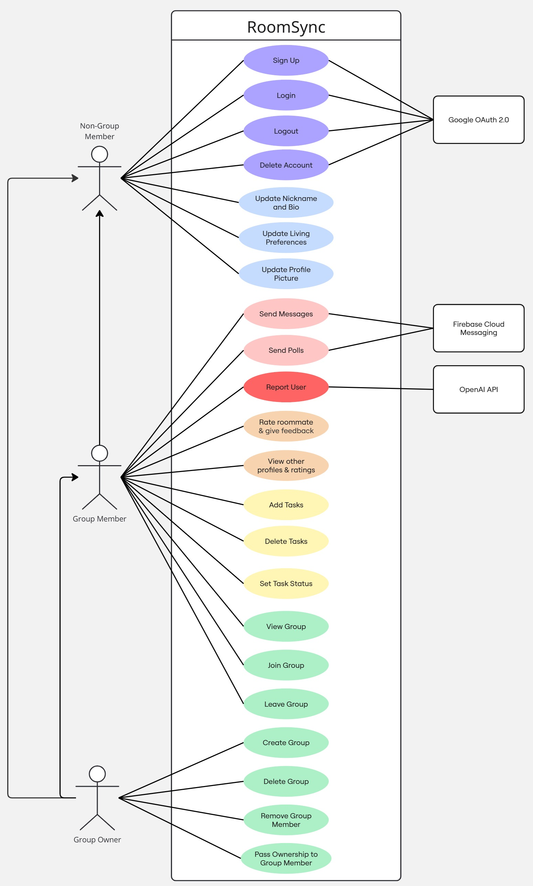

# Requirements and Design

## 1. Change History

| **Change Date**   | **Modified Sections** | **Rationale** |
| ----------------- | --------------------- | ------------- |
| September 26, 2025 | Initial Plan | First milestone submission (M2) |
| October 28, 2025 | Section 4.1 - Main Components and Interfaces | Added detailed REST API endpoint specifications and internal component interface signatures with parameters, return types, and descriptions as required for M3. This provides clear contract definitions between front-end and back-end components. |
| October 28, 2025 | Section 4.6 - Sequence Diagrams for Major Use Cases | Added five sequence diagrams (Login, Create Group, Send Message, Add Task, Rate Roommate) using Mermaid notation to illustrate component interactions and message flows for the most critical use cases as required for M3. |
| October 28, 2025 | Section 4.7 - Non-Functional Requirements Implementation | Added detailed implementation descriptions for all three non-functional requirements (Performance, Reliability, Security), explaining the specific technologies, algorithms, and architectural decisions used to achieve each requirement as required for M3. |

---

## 2. Project Description

RoomSync is a comprehensive roommate management application designed to streamline the process of connecting with and living harmoniously with roommates. The app addresses common challenges in shared living situations by providing tools for communication, task management, and accountability through a rating system.

The application targets university students, young professionals, and anyone seeking or currently residing in a shared accommodation. RoomSync facilitates the entire roommate lifecycle– from viewing roommates track records to pick a 'good roommate', through creating a space to encourage communication and task coordination, to providing feedback and ranking that helps build trustworthy roommate profiles for future living arrangements.

---

## 3. Requirements Specification

### **3.1. List of Features**

**User Authentication** - Secure user sign up or login using Google authentication service.

**User Profile Management** - An user must fill out all mandatory fields (section a), upon user profile creation. Users can also choose to fill out optional fields (section b). Editable fields can be changed anytime in the user management page whereas non-editable fields can't be changed after account creation. User profiles can be shared for housing/roommate applications

- **Mandatory/Not editable (kept private)**
    - Name (Legal first and last name)
    - DOB
    - Gender
    - Email (this will be automatically filled out after creating an account through user authentication)

- **Optional/editable**
    - Nickname/Username
    - Bio
    - Profile picture
    - Living preference/expectations (ex. morning/night person, drinking, partying, noise, profession/student)

**Group Management**– Users have an option to either create a new group or join an existing group.

- **Create Group**: Must enter group name (editable) and a unique group (not editable) code will be created. This group code can be shared.
- **Join Group**: Users can enter a unique group code to join a group.
- **Maximum 8 users in a group**: Additional users will be unable attempt to join group
- **View Group**: See group members profiles, name of group and each member's move-in date/group join date.
- **Leave Group**: Any user part of a group can leave the group.

**Group Communication** - Real-time messaging system with all group members. Integrated polling functionality to block certain times on the calendar for group decisions with default options: yes or no. Polls will expire within a week.

**Group Task Management** - Algorithmic task assignment and tracking system for household responsibilities

- **View Tasks**: Users can view all tasks by each week and the status of the tasks.
- **Set Task Status**: Upon task creation, the default will be set to 'incomplete'. Users select task status as 'in-progress' or 'completed'.
- **Create Task**: Users must enter: task name, repeated duration (ex.weekly, bi-weekly), difficulty of task(weight of task). Tasks will be shared among all group members.
- **Task Assignment**: When a task is created, they will be assigned at the start of the week through an algorithm for fair allocation based on weight on ease of task.

**Roommate Rating System**- Users can rate roommate experience after living with them for a minimum of one month.

- **Objective rating** - Task list completion rate
- **Subjective rating** - Reputation score: Users can give their roommates a score out of 5 and leave comments and testimonies to describe their personal living experience
- While bad roomates might be able to delete account or not have one, it is still a good way for good roommates to build up a track record of cleanliness for future rooms

**User Moderation** - Moderation through a LLM that filters reviews on profiles

- Chats would be too expensive to moderate every chat message so users can report messages and an AI will review the batch of messages with context. If the user is deemed inappropriate, a warning will be issued and the user will be temporarily banned. This will affect the user's rating.
- Reviews will be auto reviewed on creation through the LLM but users can report reviews for manual review

### **3.2. Use Case Diagram**

### **3.3. Actors Description**
1. **Non-Group Member**: A registered user who is not currently part of any roommate group. Can create and edit their profile, create new groups, and join existing groups through invitation codes. Cannot access group-specific features like chat, task management, or rating systems since these require active group membership.

2. **Group member**: A registered user who belongs to a roommate group but is not the group owner. Has access to all group features including group chat, polling, task management (viewing and completing assigned tasks), viewing other group members' profiles, and rating roommates (must have lived together for minimum one month). Can leave the group voluntarily but cannot remove other members or delete the group.

3. **Group owner**: A group member with additional administrative privileges. Can perform all group member functions plus remove other group members from the group, delete the entire group, and transfer ownership to another group member. Also has rating privileges for roommates they have lived with for the required minimum period.

### **3.4. Use Case Description**
- **Use cases for User Authentication**:
1. **Create account**: Secure account creation using Google OAuth
2. **Login to account**: Secure account login using Google OAuth

- **Use cases for User Profile Management**:
3. **Update nickname and bio**: Users can choose a nickname and have a bio
4. **Update living preferences**: Users can indicate living preferences by selecting descriptions that suit them best
5. **Update profile picture**: Users can add, change or remove their profile picture

- **Use cases for Group Management**:
6. **Create group**: Establish a new living group and generate a unique invitation code for prospective roommates
7. **Join group**: Join an existing roommate group by entering unique invitation code
8. **Edit/View group**: View members of group and group name
9. **Leave group**: Group members can leave a group they are a part of.
10. **Delete group**: Group owner can dissolve a group and the unique invitation code will no longer be valid.
11. **Remove group member**: Group owner can remove group members
12. **Pass ownership to another user**: Group owner can pass admin position to a group member

- **Use cases for Group Communication**:
13. **Send messages**: Real-time messaging system for communication between all group members
14. **Create and send polls**: A voting mechanism for group decisions regarding household policies and activities

- **Use cases for Group Task Management**:
15. **Add tasks**: Create tasks to be shared among all roommates by setting task name and duration. After adding tasks, automatically distribute of household responsibilities among roommates
16. **Delete tasks**: Delete tasks if task is no longer needed.
17. **Set task status**: Monitor task completion status and track individual contributions to shared responsibilities

- **Use cases for Roommate Rating System**:
18. **Give rating**: Rate roommate performance after completion of living arrangement
19. **Write feedback**: Add comments about roommate performance after completion of living arrangement
20. **View profile & ratings**: View other people's profiles, ratings and comments about that person.

- **Use cases for User Moderation**:
21. **Reports user**: Uses LLM to identify inappropriate users and messages

### **3.5. Formal Use Case Specifications (5 Most Major Use Cases)**

#### Use Case 1: Create account

**Description**: Secure account creation process using Google OAuth. User profiles will also be created.

**Primary actor(s)**: Non-Group Members/Users

**Main success scenario**:
1. A person with an existing google account clicks 'create account'
2. Selects the google account they want to use to create account in pop-up
3. Checks account with that google account can be created
4. User is asked to fill out a user profile. Must fill out mandatory fields, including full legal name, date of birth, and gender.
5. User clicks 'next'
6. Users can fill out optional fields: nickname, bio, select living preferences and upload a profile picture. Message informs users that these fields are optional.
7. User clicks 'finish'
8. Message that confirms account creation will be displayed

**Failure scenario(s)**:
- 3a. A user who has an existing account tries to create an account
    - System displays an error message saying that an account associated with that google account already exists and suggests logging in instead
- 5a. User clicks finished but one or more mandatory fields are left empty
    - System displays an error message saying that all mandatory fields must be completed
- 5b. User clicks finished but one or more mandatory fields don't meet requirements
    - System displays an error message saying name must be below 100 characters
    - System displays an error message saying that the birthday is set to the future and is invalid.
- 6a. User uploads profile picture file that is too large
    - System displays an error message saying that the file is too large
- 6b. User uploads incorrect format of profile picture
    - System displays an error message saying that profile pictures must be a PNG file
- 7a. User clicks finished but one or more optional fields don't meet requirements
    - System displays an error message saying nickname must be below 100 characters
    - System displays an error message saying bio must be below 100 words

#### Use Case 6: Create Roommate Group

**Description**: Non-group member establishes a new roommate group and receives invitation code to share with potential roommates.

**Primary Actor(s)**: Non-Group Member/User

**Main Success Scenario**:
1. User navigates to group creation page
2. User enters group name
3. User clicks 'confirm' to create group
4. System generates and displays an unique invitation code
5. System creates a group with the user as group owner, along with saving the group name and the unique invitation code to identify the group.
6. System displays group dashboard displaying the group name and invitation code
7. The group owner can share the invitation code with potential roommates who can join the group.

**Failure Scenarios**:
- 2a. Group name is left empty
    - System displays error saying that a group name must be entered
- 2b. Group name is longer than 100 characters
    - System displays error saying that a group name must be less than a 100 characters
- 3a. User already belongs to a group
    - System displays error that user must leave current group first to create a group
    - User is redirected to current group dashboard

#### Use Case 14: Group Chat Polling

**Description**: Group members can create and send polls for household decisions in group chat.

**Primary Actor**: Group Member, Group Owner

**Main Success Scenario**:
1. User opens group chat interface
2. User clicks "Create Poll" button
3. User enters poll question and answer options. Default options of yes or no will be automatically provided
4. User sends the poll to chat.
5. System broadcasts the poll to all group members in real-time
6. Other group members receive message notifications
7. Group members can vote on poll options by clicking on the options
8. System displays results when poll closes automatically after 1 week or when all members have voted

**Failure Scenarios**:
- 3a. Poll creation with invalid parameters
    - System displays error message saying that a question and at least two options must be present
- 3b. Poll creation with invalid length
    - System displays an error message saying that option names should be less than 100 characters and questions should be less than 50 words.
- 4a. Message fails to send due to network issues
    - System shows "message failed" indicator. Suggests sending poll at a later time.
    - User can retry sending message
- 5a. Real-time connection lost
    - System attempts to reconnect automatically
    - User sees "reconnecting" status until connection restored

#### Use Case 15: Add tasks

**Description**: A household task that will be equally distributed among all roommates is created. The system assigns tasks to group members using a fair allocation algorithm.

**Primary Actor**: Group Member, Group Owner

**Main Success Scenario**:
1. User clicks 'Create Task'
2. User enters the task name, repeated duration and weighting of task.
3. User clicks 'save'
4. System will equally distribute task among all roommates and assign each task to the roommates.
5. Each user will be able to see their assigned tasks on their dashboard. They can also see other roommates' tasks below it.

**Extensions/Failure Scenarios**:
- 2a. Task name, repeated duration or weighting of task is left incomplete or invalid
    - System displays error saying that all fields must be completed to create a task
- 4a. Algorithm fails to distribute tasks fairly
    - System falls back to round-robin assignment method
    - System notifies group owner of algorithm failure
- 5a. User disputes assigned task as unfair
    - System provides task assignment rationale based on algorithm
    - Group owner can manually reassign task if needed
- 5b. Task marked complete but disputed by other members
    - System allows group members to flag incomplete tasks
    - Group owner can reset task status for resolution

#### Use Case 18,19: Rate Roommates

**Description**: Group members provide feedback on roommate performance after living together for a one month minimum period.

**Primary Actor**: Group Member, Group Owner

**Main Success Scenario**:
1. System verifies user has lived with target roommate for a minimum of 30 days by comparing the move-in date and current date.
2. User selects a specific roommate within the same group to rate
3. System calculates an objective rating based on displayed task completion statistics
4. User enters subjective numerical rating (1-5 scale)
5. User writes optional testimonial/comments
6. User presses 'submit'
7. System sends testimonials to LLM to validate rating content for appropriate language.
8. Once verified, rating is added to roommate's profile
9. System updates roommate's overall rating score

**Extensions/Failure Scenarios**:
- 1a. Minimum cohabitation period not met
    - System displays error message with remaining days needed to rate user
    - User cannot proceed with rating until requirement met
    - User is redirected back to rating selection page
- 2a. User attempts to rate same roommate multiple times
    - System detects existing rating from user
    - System offers option to update existing rating instead
- 2b. User tries to rate themselves
    - System prevents self-rating with error message
    - User is redirected back to rating selection page
- 4a. User doesn't enter any numerical rating from a scale of 1-5
    - System displays error saying that the user must select a rating between 1-5
- 5a. Testimonial/Feedback is too long
    - System displays an error saying testimonial must be under 300 words.
- 7a. Inappropriate content detected in testimonial
    - System flags content for manual review
    - Rating is held pending moderation approval
- 7b. LLM is not functioning
    - System displays error saying that review is submitted but will be reviewed and verified at a later time

### **3.6. Screen Mock-ups**

### **3.7. Non-Functional Requirements**

1. **Performance Requirement**
    - **Description**: Real-time messaging must deliver messages within 2 seconds under normal network conditions. This requirement is critical for effective group communication and ensures that urgent household matters can be communicated promptly. The 2-second threshold balances user expectations for instant messaging with technical constraints of mobile networks.

2. **Reliability Requirement**
    - **Description**: Task completion data must be persistent and accurate with 99.9% uptime. This requirement is essential because the rating system depends on reliable task tracking data, and users rely on this information for future roommate matching decisions. High availability ensures continuous access to critical household management features.

3. **Security Requirement**
    - **Description**: User profile and group chat data must be encrypted in transit and at rest using AES-256 encryption. This requirement addresses privacy concerns inherent in sharing personal living preferences and private group communications. Strong encryption protects sensitive information about users' living situations and personal habits.

---

## 4. Designs Specification
### **4.1. Main Components and Interfaces**
1. **Front-End Mobile Application (Android/Kotlin)**
    - **Purpose**: Provides the user interface and handles all user interactions. It enables authentication, profile management, group management, messaging, task management, and roommate rating.
    - **Interfaces**: The front-end communicates with the back-end via HTTP/REST endpoints.
        
        1. **Authentication Interface**
            - `POST /api/auth/signup(token: String): AuthResponse`
                - Purpose: Creates a new user account using Google OAuth token
                - Parameters: Google ID token from OAuth
                - Returns: Success status, user data, and JWT authentication token
            
            - `POST /api/auth/login(token: String): AuthResponse`
                - Purpose: Authenticates existing user with Google OAuth token
                - Parameters: Google ID token from OAuth
                - Returns: Success status, user data, and JWT authentication token
        
        2. **Profile Management Interface**
            - `PUT /api/users/profile(name: String, dob: Date, gender: String): UserResponse`
                - Purpose: Sets mandatory user profile fields (non-editable after creation)
                - Parameters: Legal name, date of birth, gender
                - Returns: Updated user profile
            
            - `PUT /api/users/optionalProfile(bio?: String, profilePicture?: String, livingPreferences?: LivingPreferences): UserResponse`
                - Purpose: Updates optional profile fields (editable anytime)
                - Parameters: Optional bio, profile picture URL, living preferences
                - Returns: Updated user profile
            
            - `DELETE /api/users/me(): SuccessResponse`
                - Purpose: Deletes the current user's account
                - Returns: Success confirmation
        
        3. **Group Management Interface**
            - `POST /api/group(name: String): GroupResponse`
                - Purpose: Creates a new roommate group with unique invitation code
                - Parameters: Group name (max 100 characters)
                - Returns: Group data including generated group code
            
            - `POST /api/group/join(groupCode: String): GroupResponse`
                - Purpose: Joins an existing group using invitation code
                - Parameters: 4-character alphanumeric group code
                - Returns: Updated group data with all members
            
            - `GET /api/group(): GroupResponse`
                - Purpose: Retrieves current user's group information
                - Returns: Group data with member details and ratings
            
            - `DELETE /api/group/member/:memberId(): GroupResponse`
                - Purpose: Removes a member from group (owner only)
                - Parameters: User ID of member to remove
                - Returns: Updated group data
            
            - `DELETE /api/group/leave(): SuccessResponse`
                - Purpose: Allows non-owner member to leave the group
                - Returns: Success confirmation
        
        4. **Messaging & Polling Interface**
            - `GET /api/chat/:groupId/messages(page?: Number, limit?: Number): MessageListResponse`
                - Purpose: Retrieves paginated message history for a group
                - Parameters: Group ID, optional page and limit
                - Returns: Array of messages with pagination info
            
            - `POST /api/chat/:groupId/message(content: String): MessageResponse`
                - Purpose: Sends a text message to group chat
                - Parameters: Message content (max 1000 characters)
                - Returns: Created message with sender info
            
            - `POST /api/chat/:groupId/poll(question: String, options: String[], expiresInDays?: Number): MessageResponse`
                - Purpose: Creates and sends a poll to group chat
                - Parameters: Poll question, 2-10 answer options, optional expiration days
                - Returns: Created poll message
            
            - `POST /api/chat/:groupId/poll/:messageId/vote(option: String): MessageResponse`
                - Purpose: Casts or updates vote on a poll
                - Parameters: Selected option from poll
                - Returns: Updated poll with vote counts
            
            - `DELETE /api/chat/:groupId/message/:messageId(): SuccessResponse`
                - Purpose: Deletes own message from chat
                - Parameters: Message ID
                - Returns: Success confirmation
        
        5. **Task Management Interface**
            - `POST /api/task(name: String, difficulty: Number, recurrence: String, requiredPeople: Number, description?: String, deadline?: Date, assignedUserIds?: String[]): TaskResponse`
                - Purpose: Creates a new household task
                - Parameters: Task name, difficulty (1-5), recurrence pattern, number of people required, optional description, deadline, assigned users
                - Returns: Created task with assignments
            
            - `GET /api/task(): TaskListResponse`
                - Purpose: Retrieves all tasks for current user's group
                - Returns: Array of tasks with assignment details
            
            - `GET /api/task/my-tasks(): TaskListResponse`
                - Purpose: Retrieves tasks assigned to current user for current week
                - Returns: Array of assigned tasks
            
            - `PUT /api/task/:id/status(status: String): TaskResponse`
                - Purpose: Updates status of assigned task
                - Parameters: Task status (incomplete, in-progress, completed)
                - Returns: Updated task
            
            - `POST /api/task/:id/assign(userIds: String[]): TaskResponse`
                - Purpose: Manually assigns task to specific users for current week
                - Parameters: Array of user IDs
                - Returns: Task with updated assignments
            
            - `POST /api/task/assign-weekly(): TaskAssignmentResponse`
                - Purpose: Algorithmically assigns all tasks for the current week
                - Returns: All tasks with new weekly assignments
            
            - `GET /api/task/week/:weekStart(): TaskListResponse`
                - Purpose: Retrieves tasks for a specific week
                - Parameters: Week start date
                - Returns: Tasks with assignments for that week
            
            - `DELETE /api/task/:id(): SuccessResponse`
                - Purpose: Deletes a task (creator or owner only)
                - Parameters: Task ID
                - Returns: Success confirmation
        
        6. **Rating & Moderation Interface**
            - `POST /api/rating(ratedUserId: String, groupId: String, rating: Number, testimonial?: String): RatingResponse`
                - Purpose: Submits or updates rating for a roommate (requires 30 days cohabitation)
                - Parameters: User ID to rate, group ID, rating (1-5), optional testimonial (max 500 chars)
                - Returns: Created/updated rating
            
            - `GET /api/rating/:userId(): RatingStatsResponse`
                - Purpose: Retrieves all ratings for a user
                - Parameters: User ID
                - Returns: Array of ratings with average rating and total count
            
            - `GET /api/rating/user/:userId/group/:groupId(): RatingStatsResponse`
                - Purpose: Retrieves ratings for a user in a specific group
                - Parameters: User ID, group ID
                - Returns: Group-specific ratings and average
            
            - `PUT /api/users/report(reportedUserId: String, reason: String, context?: String): ReportResponse`
                - Purpose: Reports inappropriate user behavior for LLM review
                - Parameters: Reported user ID, reason for report, optional context
                - Returns: Report submission confirmation

2. **Back-End Server (Node.js/TypeScript)**
    - **Purpose**: Manages business logic, authentication, database interactions, group algorithms, and communication between front-end and database.
    - **Internal Component Interfaces**:
        
        1. **Authentication Service (AuthService)**
            - `signup(email: String, name: String, googleId: String): Promise<AuthResult>`
                - Purpose: Creates new user account and generates JWT token
                - Validates Google credentials and ensures unique user
            
            - `login(email: String): Promise<AuthResult>`
                - Purpose: Authenticates existing user and generates JWT token
                - Verifies user exists and returns user data with token
            
            - `protect(req: Request, res: Response, next: NextFunction): void`
                - Purpose: Middleware to verify JWT token and authenticate requests
                - Decodes token and attaches user data to request object
        
        2. **Database Access Layer (MongoDB/Mongoose Models)**
            - `User.create(userData: UserData): Promise<User>`
                - Purpose: Creates new user document in database
            
            - `User.findById(id: String): Promise<User>`
                - Purpose: Retrieves user by ID
            
            - `Group.create(groupData: GroupData): Promise<Group>`
                - Purpose: Creates new group with auto-generated unique code
            
            - `Group.findOne(query: Object): Promise<Group>`
                - Purpose: Finds single group matching query criteria
            
            - `Task.find(query: Object): Promise<Task[]>`
                - Purpose: Retrieves tasks matching query criteria
            
            - `Message.create(messageData: MessageData): Promise<Message>`
                - Purpose: Creates new message document
            
            - `Rating.getAverageRating(userId: String): Promise<RatingStats>`
                - Purpose: Calculates average rating for a user
        
        3. **WebSocket Service (Socket.IO)**
            - `getIO(): Server`
                - Purpose: Returns Socket.IO server instance for real-time communication
            
            - `joinRoom(socket: Socket, groupId: String): void`
                - Purpose: Adds socket connection to group room for message broadcasting
            
            - `emit(event: String, data: Object): void`
                - Purpose: Broadcasts real-time events to connected clients
        
        4. **Task Assignment Algorithm**
            - `assignTasksWeekly(groupId: String): Promise<Task[]>`
                - Purpose: Fairly distributes tasks among group members for current week
                - Uses randomization and required people count for balanced allocation

3. **LLM Moderation System**
    - **Purpose**: Provides automated review of roommate reviews and profiles, and handles reported chat messages in batches.
    - **Interfaces**:
        1. **Profile & Review Scanner**
            - **Purpose**: Automatically checks newly created content for inappropriate or harmful material.
        2. **Message Batch Reviewer**
            - **Purpose**: Reviews reported chat logs in context when flagged by users.

### **4.2. Databases**
1. **MongoDB (Self-Hosted on Google Cloud VM)**
    - **Purpose**: Stores persistent data for the application, including user profiles, group information, tasks, chat history, ratings, and moderation reports. MongoDB's document-based model supports dynamic schemas, which is suitable for evolving profile structures, group data, and task allocation.
    - **Deployment**: MongoDB will be installed and configured directly on a Google Cloud Compute Engine VM controlled by the project team. This avoids the use of prohibited third-party managed services (e.g., MongoDB Atlas) while still fulfilling the requirement for cloud deployment.
    - **Collections (examples)**:
        - **Users**: Authentication ID, legal name, DOB, gender, email, nickname, profile picture, bio, preferences.
        - **Groups**: Group name, unique group code, members, join/move-in dates.
        - **Messages**: Chat messages with sender, timestamp, and group ID.
        - **Tasks**: Task name, difficulty, recurrence, assigned member(s), completion status.
        - **Ratings**: Objective and subjective roommate ratings.
        - **Reports**: Flagged messages and reviews for LLM moderation.

### **4.3. External Modules**
1. **Google Authentication (OAuth 2.0)**
    - **Purpose**: Provides secure login and sign-up functionality. Ensures each user's identity is verified using their Google account, and automatically provides the email field for the profile.

2. **Firebase Cloud Messaging (FCM)**
    - **Purpose**: Sends real-time push notifications to the Android client, such as new chat messages, poll updates, or task reminders.

3. **Express.js (Node.js Web Framework)**
    - **Purpose**: Simplifies API endpoint creation and request handling in the Node.js/TypeScript back-end. Manages routing for authentication, profile management, group operations, and messaging services.

4. **Mongoose (MongoDB ODM for Node.js/TypeScript)**
    - **Purpose**: Provides schema definitions and validation for MongoDB collections. Simplifies database queries, relationships, and ensures type safety when integrated with TypeScript.

5. **LLM Moderation API (Custom Integration)**
    - **Purpose**: Handles automated review of reviews, profiles, and flagged chat messages. Ensures inappropriate or harmful content is detected before reaching other users.

### **4.4. Frameworks and Libraries**
1. **Jetpack Compose (Android UI Toolkit)**
    - **Purpose**: Used to build the user interface of the Android front-end natively in Kotlin. Provides a modern declarative framework for designing layouts, managing state, and handling UI components.
    - **Reason**: The assignment explicitly requires Jetpack Compose instead of the legacy Android Views system. It integrates seamlessly with Kotlin, improves development speed with composable functions, and ensures compatibility with Android Tiramisu (API 33) and the Pixel 7 emulator.

2. **Kotlin (Front-end Programming Language)**
    - **Purpose**: Primary language for developing the native Android mobile application. All application logic, UI handling, and local data management are implemented in Kotlin.
    - **Reason**: The assignment specifies Kotlin as the only accepted language for the Android application. Kotlin is officially supported by Google for Android development and provides modern features like null safety and coroutines.

3. **Node.js (Back-end Runtime)**
    - **Purpose**: Provides the runtime environment for the back-end server, allowing the application to handle HTTP requests, process data, and communicate with the front-end.
    - **Reason**: The assignment requires Node.js as the back-end runtime. Node.js is lightweight, event-driven, and well-suited for handling real-time interactions between mobile clients and the server.

4. **TypeScript (Back-end Programming Language)**
    - **Purpose**: Ensures strong typing and modern JavaScript features when building the server logic. It improves code maintainability, reduces runtime errors, and enhances developer productivity.
    - **Reason**: The assignment specifies that the server must be implemented in TypeScript. TypeScript integrates well with Node.js and provides type safety for large-scale applications.

5. **MongoDB (Database)**
    - **Purpose**: Serves as the primary database for storing persistent data such as user profiles, group information, tasks, and communication logs. Being document-oriented, MongoDB stores data in a flexible JSON-like format, making it well-suited for dynamic and evolving application requirements.
    - **Reason**: The assignment allows the choice between MySQL and MongoDB. MongoDB was selected because it is schema-less, integrates well with Node.js/TypeScript through libraries like Mongoose, and simplifies handling of nested or unstructured data, which matches the needs of this project.

6. **Google Cloud Platform (GCP)**
    - **Purpose**: Provides cloud infrastructure for deploying and hosting the Node.js/TypeScript back-end and MongoDB database. GCP services such as Compute Engine (for server deployment) and Cloud Storage (for static content, if needed) ensure scalability, reliability, and availability of the application.
    - **Reason**: The assignment requires cloud deployment, and Google Cloud was chosen because it offers robust integration with Node.js applications, student-friendly credits, and strong documentation. Additionally, MongoDB Atlas can be hosted directly through GCP, ensuring seamless deployment and management.

7. **Firebase Cloud Messaging (Push Notifications)**
    - **Purpose**: Provides push notification support for the Android front-end, enabling the application to send real-time updates and alerts to users (e.g., new group messages or task reminders).
    - **Reason**: The assignment specifically allows Firebase for push notifications. It is the industry standard for Android apps, integrates smoothly with Kotlin and Jetpack Compose, and is supported by Google Cloud for simplified setup.

### **4.6. Sequence Diagrams for Major Use Cases**

The following sequence diagrams illustrate how the components and interfaces defined in the high-level design interact to realize the five most critical use cases of the RoomSync application.

#### **4.6.1. Use Case 1: Login (User Authentication)**

#### **4.6.2. Use Case 6: Create Roommate Group**

#### **4.6.3. Use Case 14: Send Message (Group Chat)**

#### **4.6.4. Use Case 15: Add Task**

#### **4.6.5. Use Case 18-19: Rate Roommate**

### **4.7. Non-Functional Requirements Implementation**

This section describes how each non-functional requirement from section 3.7 is implemented in the system.

#### **4.7.1. Performance Requirement Implementation**
**Requirement**: Real-time messaging must deliver messages within 2 seconds under normal network conditions.

**Implementation**:
- **WebSocket Technology (Socket.IO)**: The system uses Socket.IO to establish persistent WebSocket connections between the Android client and Node.js server. This eliminates HTTP request overhead and enables instant bidirectional communication.
- **Event-Based Broadcasting**: When a user sends a message, the server immediately broadcasts it to all connected clients in the same group room using `io.to(groupId).emit('new-message', messageData)`, ensuring sub-second delivery.
- **Message Queuing**: Messages are first saved to the database, then broadcasted via WebSocket. If the WebSocket delivery fails, clients can retrieve missed messages via the REST endpoint `GET /api/chat/:groupId/messages`.
- **Efficient Database Indexing**: MongoDB indexes on `groupId` and `createdAt` fields ensure message retrieval queries execute in under 50ms even with thousands of messages.
- **Pagination**: Message history uses pagination (default 50 messages per page) to prevent large data transfers that could slow down the application.

#### **4.7.2. Reliability Requirement Implementation**
**Requirement**: Task completion data must be persistent and accurate with 99.9% uptime.

**Implementation**:
- **Cloud Deployment on Google Cloud Platform**: The Node.js backend and MongoDB database are deployed on Google Compute Engine, which provides 99.95% uptime SLA and automatic instance health monitoring.
- **Database Persistence**: All task data is stored in MongoDB with proper schema validation to ensure data integrity. Task assignments include `status`, `completedAt` timestamps, and `weekStart` fields for historical tracking.
- **Atomic Operations**: Task status updates use Mongoose's atomic operations (`findOneAndUpdate`) to prevent race conditions when multiple users interact with the same task.
- **Data Backup**: MongoDB is configured with regular automated backups on Google Cloud Storage to protect against data loss.
- **Task Assignment Immutability**: Historical task assignments are preserved even when new assignments are created for subsequent weeks, ensuring accurate completion rate calculations over time.
- **Aggregation for Rating Calculation**: The rating system uses MongoDB aggregation pipelines to calculate average ratings from all historical ratings, ensuring objective task completion metrics are always accurate.

#### **4.7.3. Security Requirement Implementation**
**Requirement**: User profile and group chat data must be encrypted in transit and at rest using AES-256 encryption.

**Implementation**:
- **Encryption in Transit**:
  - All API endpoints use HTTPS with TLS 1.3 protocol, which employs AES-256-GCM encryption for data transmission between the Android client and the Node.js server.
  - WebSocket connections (Socket.IO) are configured to use secure WebSocket protocol (WSS) over TLS, ensuring encrypted real-time messaging.
  - Google OAuth tokens are transmitted securely and never stored on the client beyond the authentication flow.
  
- **Encryption at Rest**:
  - MongoDB is configured with encryption at rest using Google Cloud's native encryption, which uses AES-256 encryption for all data stored on disk.
  - Sensitive user fields (email, name, DOB, gender) are stored in encrypted MongoDB collections.
  - Profile pictures are stored as URLs pointing to Google Cloud Storage, which also uses AES-256 encryption for stored objects.
  
- **Authentication and Authorization**:
  - JWT tokens are signed using HS256 algorithm with a secure secret key (256-bit) stored as an environment variable.
  - All protected routes use the `protect` middleware which verifies JWT signatures and expiration before granting access.
  - Group chat access is validated by verifying the requesting user is a member of the group before returning messages or allowing message posting.
  - Password-free authentication via Google OAuth eliminates risks associated with password storage.

- **Data Access Control**:
  - Users can only access data for groups they are members of, enforced at the API route level.
  - Task and rating operations validate group membership and minimum cohabitation duration before allowing actions.
  - Sensitive operations (group deletion, member removal) are restricted to group owners only.

### **4.5. Dependencies Diagram**
images/HighLevelDesign.webp

**Dependency Relationships:** 
- Frontend calls Authentication Service, API Gateway
- API Gateway routes to Group Management, Chat Service, Task Management Service
- Authentication Service integrates with Google Auth API and User Database
- Group Management Service accesses Group Database and User Database
- Chat Service utilizes Chat Database and Firebase FCM for notifications
- Task Management Service manages Task Database, integrates with Google Maps API for location-based features
- All services can access Firebase FCM for push notifications
