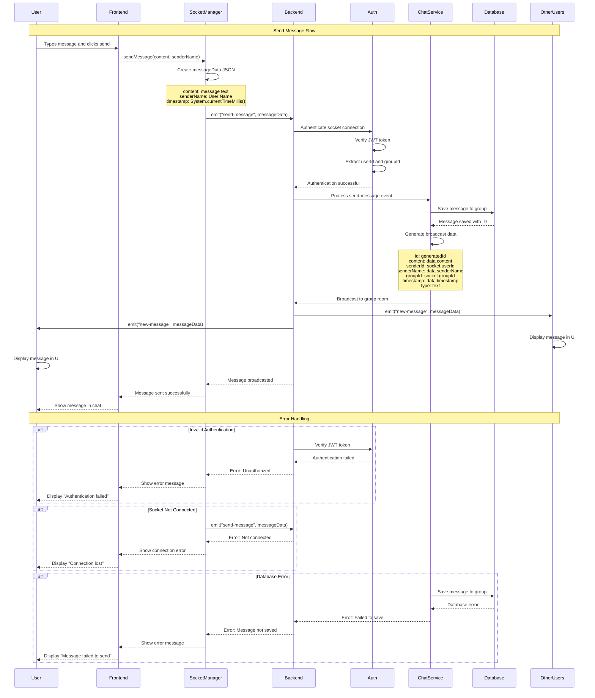

# Send Message Sequence Diagram

This diagram illustrates the complete flow when a user sends a message in the chat system.

## Key Components:

1. **User**: The person sending the message
2. **Frontend (Android)**: The mobile app interface
3. **SocketManager**: Handles Socket.IO connection and message sending
4. **Backend (Socket.IO)**: The server handling real-time communication
5. **Auth Middleware**: Validates JWT tokens and user authentication
6. **Chat Service**: Processes messages and manages group communication
7. **Database**: Stores messages persistently
8. **Other Users**: Other members of the group receiving the message

## Main Flow:

1. User types message and clicks send
2. Frontend calls SocketManager.sendMessage()
3. SocketManager creates messageData JSON and emits to backend
4. Backend authenticates the socket connection
5. Chat service saves message to database
6. Message is broadcasted to all users in the group
7. All users (including sender) receive the message in real-time

## Error Handling:

- **Invalid Authentication**: JWT token verification fails
- **Socket Not Connected**: No active Socket.IO connection
- **Database Error**: Message fails to save to database
